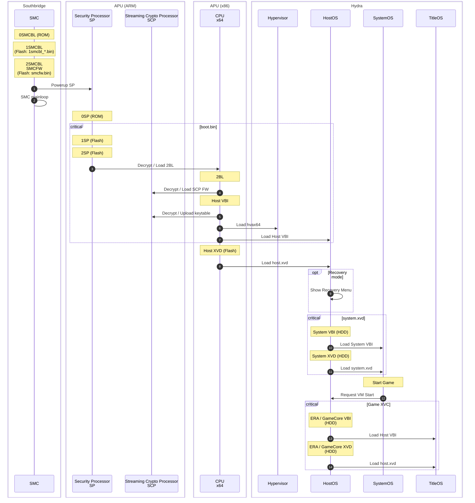

<!-- TITLE: Bootloaders -->
<!-- SUBTITLE: A quick summary of Bootloaders -->

# Bootloaders
Bootloaders used on Xbox One.

## Bootchain overview

This is a broad overview of the secure-bootchain of Xbox One PHAT/S/X.

The Xbox Series-family might differ slightly from this, as they use a different primary bootmedium (SSD instead of eMMC Flash).

## SPBL

Primary bootloader that is used for initialising the Security Processor,
decrypting the future stages, verifying the console certificates, fuses
and more. This sequence is split into 3 boot stages.

  - 0SP : Stored in SP ROM (factory)
  - 1SP : Patched into boot.bin
  - 2SP : Patched into boot.bin

## SMC

  - 0SMCBL: Stored in SB ROM (factory)
  - 1SMCBL: In Flash, named `1smcbl_{a,b}.bin`
  - 2SMCBL / SMCFW: In Flash, named `smcfw.bin`

## 2BL

Started after the SP has completed its boot. Proceeds to intialise the
rest of the console and then begins booting into the Host VBI.

## SCP
(S)treaming (C)rypto (P)rocessor - internal crypto engine on the APU die.
Data blob that is uploaded to the SCP, for initialization?!
Initialization phase: Unknown, somewhere in between 2BL and VBI.

## VBI

Final boot stage which initialises the critical components of the
operating system, and essentially acts as a bootstrap.
