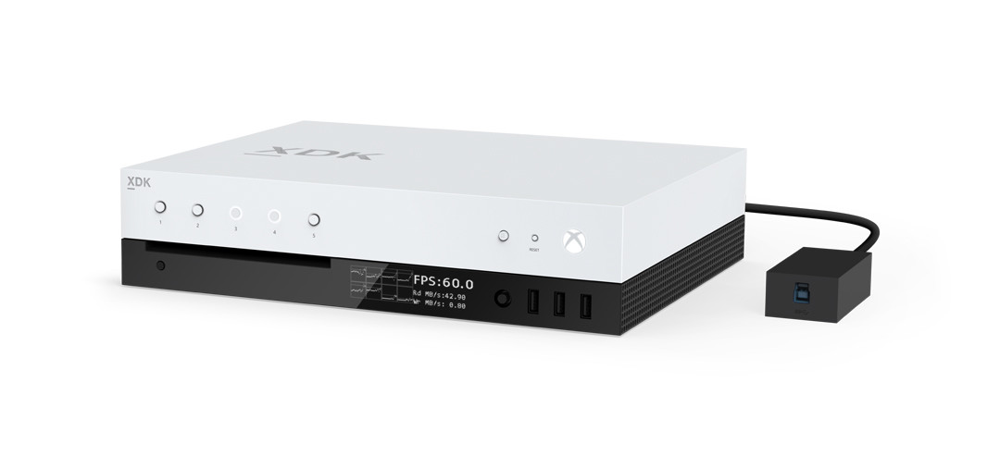
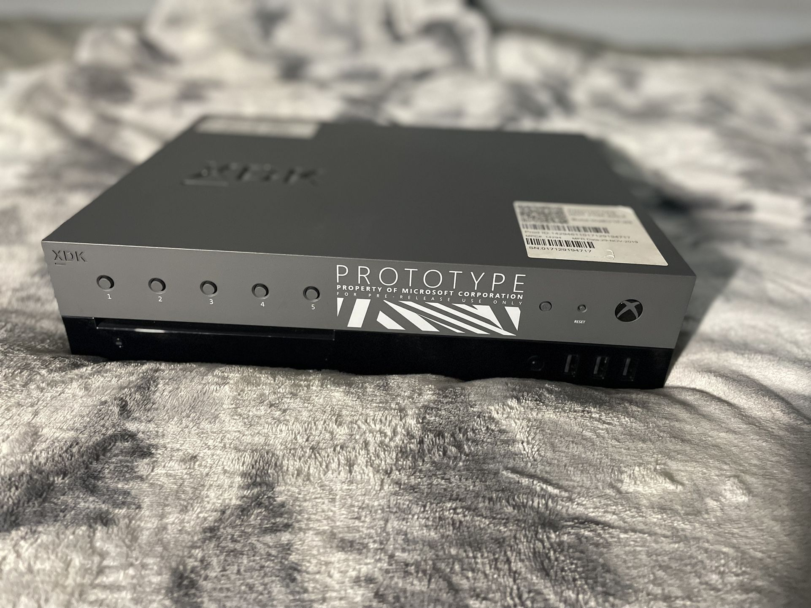
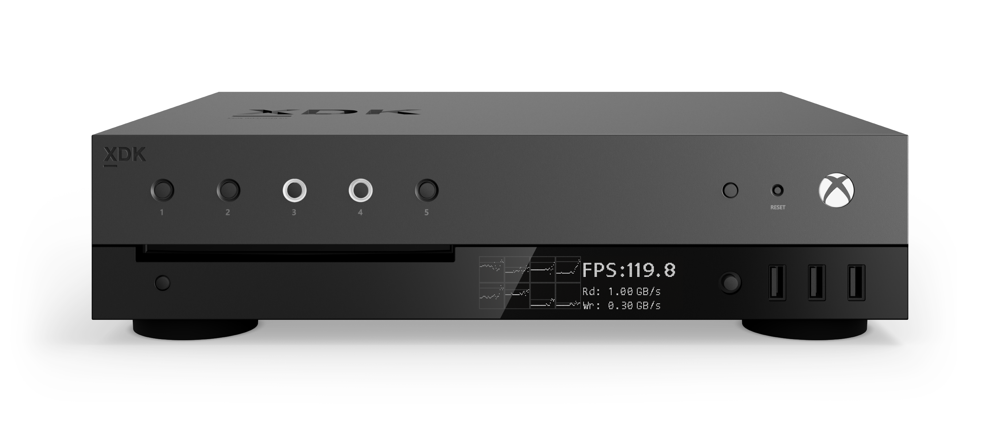

<!-- TITLE: Devkit Types -->
<!-- SUBTITLE: A quick summary of Devkit Types -->

# Devkits

Most Xbox One devkits start out life as an off the shelf retail console (with the exception of special SP kits I will cover below). An Xbox One's devkit type and abilities or capabilities are defined by a file stored on the flash called "certkeys.bin." - certkeys.bin is referred to as the [Capability Certificate](../security/certificates.md) by the Platform Security Processor ([PSP](../security/security-processor.md)) and it will be referred to as such from here on out.

It should be noted that capability certificates are locked to a particular console via the SOCID (Reported as Console ID in settings). The entire certificate is then signed to prevent tampering.

A capability certificate defines what capabilities an Xbox One console is allowed to enable (This is regulated via the [PSP](../security/security-processor.md) and to a degree, HostOS.) The capabilities range from enabling Devmode and the respective developer services, ignoring requests to blowing e-fuses, HostOS telnet and Retail debugging, and much more.

## Devkit types classified by software
There are different types of devkits

| Name             | Identification | Description                                                                                                                                                                                |
| ---------------- | -------------- | ------------------------------------------------------------------------------------------------------------------------------------------------------------------------------------------ |
| SRA Devkit       | 0x2001         | SRA (Shared Resources Access) devkit, is a legacy kit used to develop WinRT (Windows 8) SRA App. |
| UWA Devkit       | 0x2001         | This is the "$20" devkit, and allows for the development and debugging of UWP apps on SystemOS. This is the most common devkit certificate by far and expires every week. 
| ERA Devkit       | 0x4001         | This is the devkit most people think of when they picture a Xbox One devkit. ERA devkits in addition to the UWA capabilites, also allows for the activation of the ERA VM partition in Devmode. This allows for  the development, debugging and profiling of XDK based games. This is also the lowest devkit that is able to connect to the PC XDK, due to the XTF services running on GameOS and SystemOS.        
| MS Devkit        | 0x6001         | In addition to all the capabilities above, MS internal devkits enable a SYSTEM level telnet shell on all 3 operating systems (SystemOS, GameOS, and HostOS), however they are unable to run "Green" (Production) content like most games, and production builds of the Xbox OS. These certificates generally never expire.   
| SP Devkit        | 0x8001         | SP devkits are the top-tier of the standard capability certificates. In addition to all the aforementioned abilities, they also allow for custom code to be ran on the PSP/Security Processor. This includes debug versions of the bootloaders like 2BL, and PSP firmware such as 1SP. Due to this ability, most SP devkits are not converted from standard retails and instead prepared from a virgin factory board (which has yet to have the PSP programmed.) These certificates also generally never expire.
| Retail Devkit    | Unknown        | These devkits are Green versions of MS internal devkits. This allows them to debug retail games, run production versions of the Xbox OS, etc while all retaining the aforementioned mentioned capabilities. |   
| Godbox           | Unknown        |  Godboxes are the absolute top tier of devkit, capable of kernel-mode and user-mode debugging on all Green operating systems while connected to Production Xbox Live. There are two subtypes of Godboxes, Full Godboxes and Restricted Godboxes. Full Godboxes are retail or lower tier developer consoles converted into a permanent Godbox, in addition to having JTAG and serial headers soldered onto the motherboard. Restricted Godboxes are the exactly same as above, except for the fact that they require a constant connection to Microsoft's CORPNET to activate it's developer functions.

## Certificates

See [Certificates](../security/certificates.md)

## Godbox Certificate

A magical capability certificate ([$Diagnosis/debug.bin on a NTFS USB](../boot/usb-ntfs-overrides.md)) that will temporaily activate a retail console as a limited Godbox for 24 hours. Kernel/User-Mode debugging is only possible on SystemOS and GameOS, not HostOS, and the temporary kit requires authentication against Live.

## Devkit types classified by hardware
Hardware wise, a bunch of different Xbox One and Xbox Series models exist. These are some of them, which mostly correspond to the ERA type mentioned in the previous section:

**Xbox One PHAT game devkit:**

**Xbox One S game devkit:**

**Xbox One X testkit:**

**Xbox One X game devkit:**

**Xbox Series S/X game devkit (pre-release):**

**Xbox Series X game devkit (release version):**

**Xbox Series S game devkit (release version):**

## References

- Image of Xbox Series X Dev Kit from Microsoft: <https://gamedevstore.partners.extranet.microsoft.com/images/XboxDevKit2019_FrntTlt_RGB.png>
