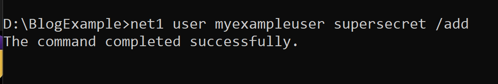
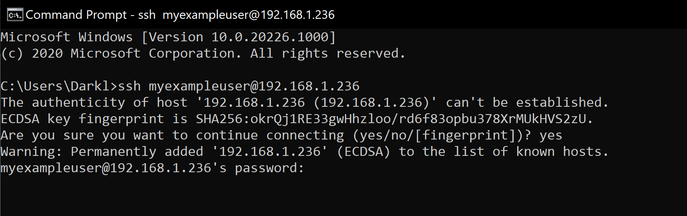

<!-- TITLE: Creating a Windows user on SystemOS -->
<!-- SUBTITLE: A guide on how to create your own Windows user on SystemOS, using net1 -->

# Creating a Windows User
## Prerequisites

  This guide assumes you have already followed the Setup Dev Mode page found [here](https://xosft.dev/wiki/setup-dev-mode/) on the Wiki. If you haven't, do so now. This guide can be skipped on ERA devkits by instead using xbrun or using an unattended script to start a system telnet session via WDP. 

## Copying Net1 

Locate net1 on your local Windows installation at `C:\Windows\System32\net1.exe.` Connect to SystemOS over sftp using the DevToolsUser creds explained above. If not already there, navigate to `D:\DevelopmentFiles.` Copy net1.exe from your local PC to the SystemOS at this path. This is required as though SystemOS includes net/net1, they are restricted to certain certificate capabilities. This restriction doesn't appear to apply to copied versions of the exe, hence the instructions above. 

## Creating your user

SSH into SystemOS using the DevToolsUser user. Navigate to `D:\DevelopmentFiles` if not already there and run the following command to create a new Windows User. Replacing "myexampleuser" with the username of your choice, and "supersecret" with the password of your choice respectively. 

## Verifying SSH

After your user has been created, go ahead and exit out of the DevToolsUser ssh session. Then in a command prompt, run following command, replacing "myexampleuser" and the IP address with your devkit's IP address respectively. 

Enter your password, and if everything went well, you should be dropped to a command prompt in your user folder.
