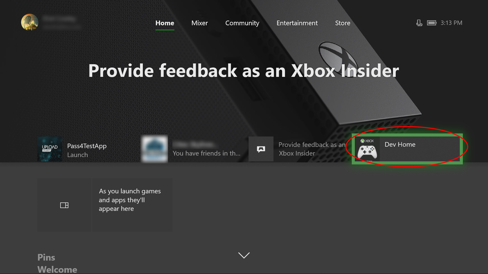
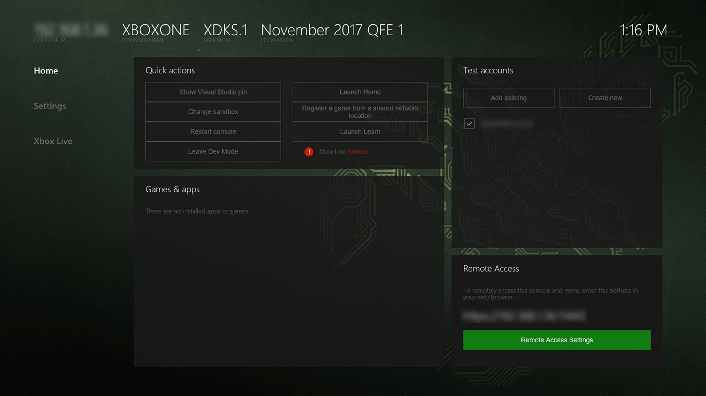
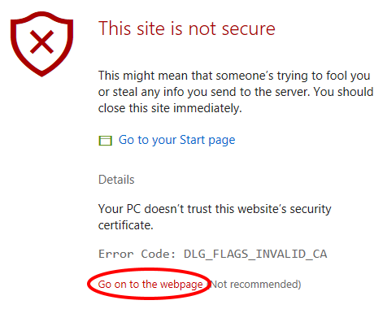

# Set up Device Portal on Xbox

The following steps show how to enable the Xbox Device Portal, which gives you remote access to your development Xbox.

1. Open Dev Home. This should open by default when you boot up your development Xbox, but you can also open it from the home screen.

    

2. Within Dev Home, on the **Home** tab, under **Remote Access**, select **Remote Access Settings**.

    

3. Check the **Enable Xbox Device Portal** setting.

4. Under **Authentication**, select **Set username and password**. Enter a **User name** and **Password** to use to authenticate access to your dev kit from a browser, and **Save** them.

5. **Close** the **Remote Access** page and note the URL listed under **Remote Access** on the **Home** tab.

6. Enter the URL in your browser, and then sign in with the credentials you configured.

7. You will receive a warning about the certificate that was provided, similar to that pictured below. In Edge, click on **Details** and then **Go on to the webpage** to access the Xbox Device Portal. In the dialog that pops up, enter the username and password that you entered previously on your Xbox.

    