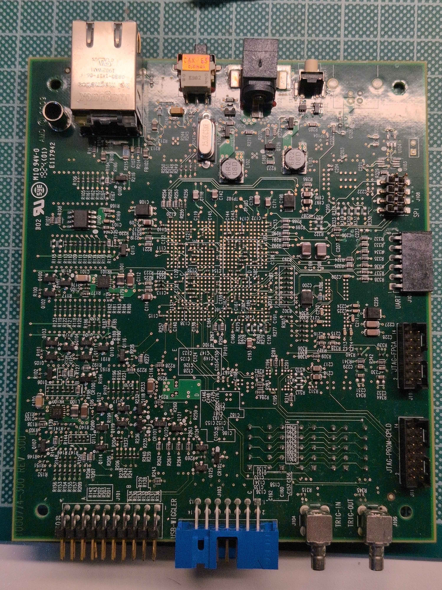
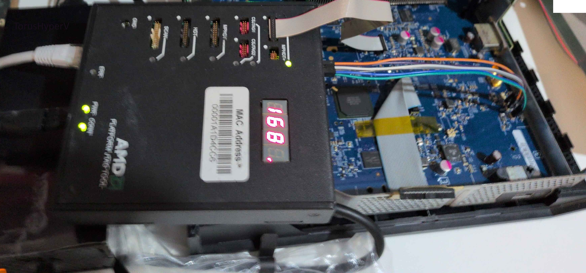

# AMD HDT (JTAG Platform)

## Introduction

The AMD HDT (Hardware Debug Tool) is the name of a protocol (and supporting hardware adapters) for using JTAG with AMD SoCs, including the SoC that powers the Xbox One family of consoles, which is based on a 0x13 family Jaguar design.

## Hardware Setup

### Hardware

The front side of the Wombat board contains headers for HDT, HDT+, MPHDT, MPHDT+(Multi Processor? HDT, for systems with multiple cores), CSJTAG (Chip Select signals required for some devices) and SCAN (JTAG chain scanning?). It contains x4 seven-segment LCDs for displaying error codes. The box features 3 LED indicators, ERR (which always powers on briefly on boot), PWR (indicating correct power supply) and CONN (which indicates connection to the host PC).

The device packs a 10/100Gb Ethernet port, an A-B switch which configures the mode of operation of the device, a RST (reset) button, and the barrel connector for the power supply (a 5V, 2A, positive-at-center connector).

On the rear, the device has two BNC connectors for Trigger A and Trigger B signal inputs, a "USB Wiggler / Raven" header (purpose unknown), and a set of GPIOs that can be used to control relays on the target board, as well as 3.3V and CPU VDDIO power supply rails.

Internally the device is powered by a Xilinx (now AMD) Spartan FPGA. Different voltage regulators step down the 5V input to supply the different rails of the FPGA and peripheral ICs.

### Setup

Multiple generations of hardware adapters exist, each most suitable for specific ranges families of AMD SoCs. Similarly, certain releases of the software might deprecate support for older families of chipsets. Leaked documentation mentions older versions of Wombat which include a USB port, which was discarded in favour of the Ethernet interface.

### Wombat

Wombat packs a Xilinx Spartan 3 FPGA and internally runs a very old build of Xilinx's Petalinux (Specifically Petalinux 2016, kernel 2.6.20-uc0) which runs multiple services that make the device function correctly (Ethernet and communication protocol, 7-segment driver, and others). It exposes the default Petalinux telnet shell with user `root` and password `root`

Userland services control peripherals like the 7-segment display, Ethernet communications, and GPIOs.

### Possum

Possum is an older adapter that might or might not work with the Xbox One. It is suggested that it was used for development of other Xbox consoles.

## Firmware (FPGA) Upgrade / Downgrade (Wombat)

Wombat devices in the wild have been observed to carry the 1.5.1 FPGA firmware image.

The available HDT 18 software packs the 1.5.0 FPGA update, which can be installed into the boards. The toolkit does not seem to download new firmware from any public endpoints.

When correctly rebooting from an FPGA update, the Wombat goes through the following code sequence:
`b222`
`b333`
`b111`

## Software Setup (HDT18)

Multiple AMD internal HDT software releases have existed over the years, but only one version has ever leaked publicly, HDT 18 which was included in the GIGABYTE Leak from circa 2020.

### Installation

Because the software is leaked / non publicly distributed, discussion of it is not described here.

### IP Addresses

The A-B switch on the AMD Wombat configures what the IP address of the device will be.
- If the Switch is in B position, the IP address will be hardcoded to 192.168.10.1
- If the Switch is in A position, a DHCP client listens in the device and the IP address must be asigned by a DHCP server in the same network.

## Usefulness in Xbox One hacking

### Discussion
First reverse-engineering efforts suggest that the most early bootloaders of the SoC like 0bl don't use HDT for output at all. Later boot stages might output trace messages over the wire if the code detects that HDT is enabled.

### Enabling
While HDT on PC-like AMD motherboards is enabled through BIOS settings, HDT on the Xbox One is enabled via the HDTOUT flag in hwinit.cfg located at offset 0x08. This file is unencrypted. Setting this value to 0x03 enables HDT.

Despite the hwinit config, enablement of HDT might still be limited by the console's capability certificate or disabled by the different boot stages.

Furthermore, devkits with the correct hardware debugging capabilities don't seem to immediately respond to HDT JTAG.

It is speculated that a specificly timed boot sequence is required for the SoC to not disable JTAG and respond over HDT, via WARM/COLD boot sequences and the assertion of the `DBREQ` signal, as well as correctly configured frequency values.

The power, WARM, COLD signals can be controlled via the HDT relays, connecting them to the Xbox One's motherboard (see empty WARM, COLD, footprints on retail motherboards) and DBREQ signals can also be toggled from the software manually or in automated ways.

## Credits
TorusHyperV, craftbenmine, tuxuser.