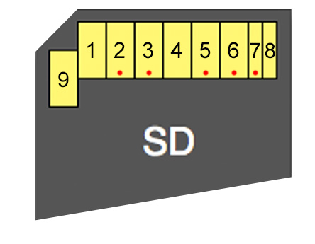

# eMMC / Flash
The flash chip is accessed via an eMMC controller.

## Filesystem
See [XBFS](xbox-boot-file-system).

## Flash chips
- SK Hynix H26M42003GMR 8GB eMMC NAND Flash (Xbox One)
- Toshiba THGBMFG6C1LBAIL 8 GB eMMC NAND Flash (Xbox One S)

## Reading eMMC via hardware

### Durango
Motherboard overview:

[Mainboard top view](emmc-flash/0_durango_read_nand_mb1.png)

[Mainboard bottom view](emmc-flash/1_durango_read_nand_mb2.png)

SD Card Connections:

**Important:**

For the x2 GND wires use 12 AWG.
For the other connections use 28 AWG.

2 = CMD

3 = GND

5 = CLK

6 = GND

7 = DAT0

Enable SMC_RESET (**VERY IMPORTANT TO DO THIS FIRST!!**)
Place a **200-300 Ohm** resistor between **J4E1.1** and **TP4E1**

[Enabling SMC_RESET](emmc-flash/3_durango_read_nand_smcreset.png)

Disconnect the SMC clock from the [Southbridge](/southbridge) by removing **R4D2**.
Save the resistor as it is needed for the Xbox One to function. If you do lose it then a solder bridge should work as the value is 0 Ohms.

[Disconnecting SMC clock](emmc-flash/4_durango_read_nand_r4d2.png)

NAND logic runs on the 1.8v rail and readers try to use 3.3v which is most of them don't work with the Xbox One NAND.

Bridge a **700-800 Ohm** resistor between **Pin 1 of U3C3** and **Ground**. This should make an output 3v3 on the rail without damaging anything because the SMC is held in reset, so it won't try to power anything on.

[Getting voltage to 3,3V](emmc-flash/5_durango_read_nand_3v3.png)

Directly underneath the NAND on the underside of the mobo are access points that will let you easily solder the **CMD**,**DAT0** and **CLK** lines.

Everything works better when you hook everything up to the SD reader with everything turned off, then turn the Xbox One on and then plug in the SD reader to the PC.

[GND solder points](emmc-flash/6_durango_read_nand_gnd.png)

[eMMC communication points](emmc-flash/7_durango_read_nand_connection.png)

Source: [Team Xecuter / xpgamesaves](https://www.xpgamesaves.com/threads/how-to-read-write-xbox-one-nand-filesystem.95025/)

## References
[SK Hynix H26M42003GMR](https://www.electronicsdatasheets.com/manufacturers/sk-hynix/parts/h26m42003gmr)
