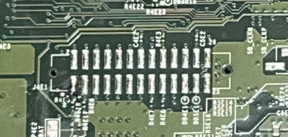
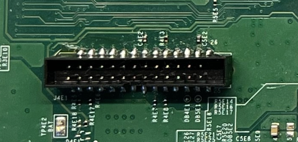
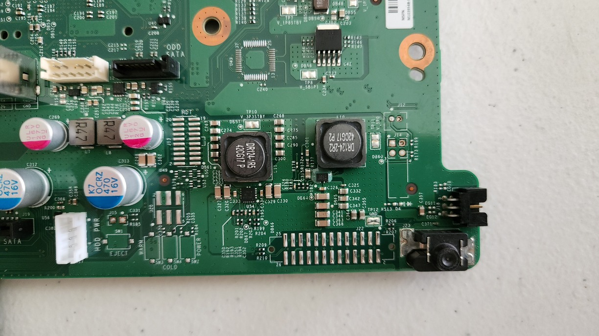
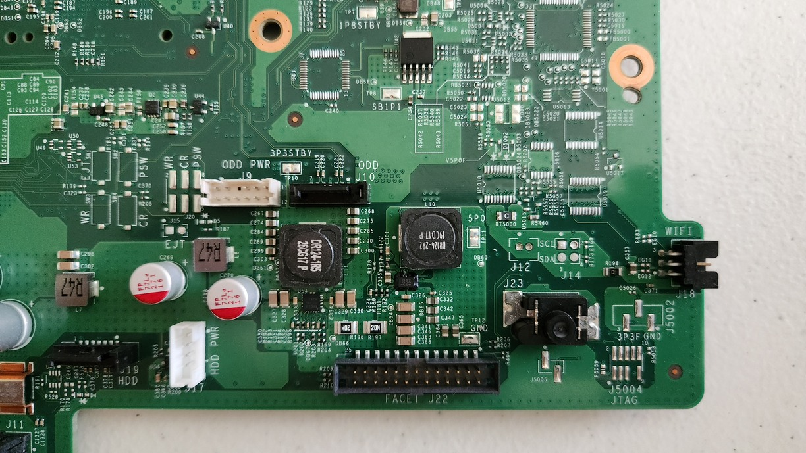
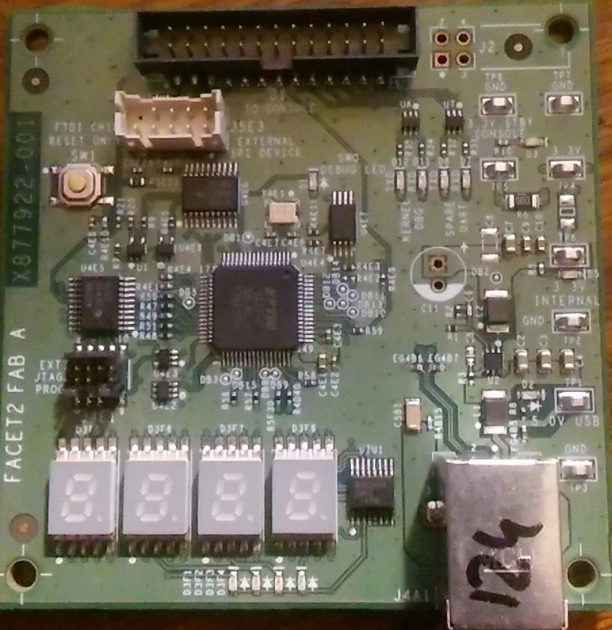
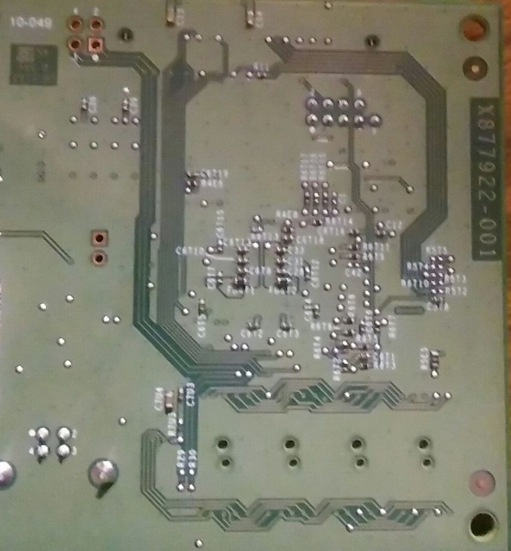
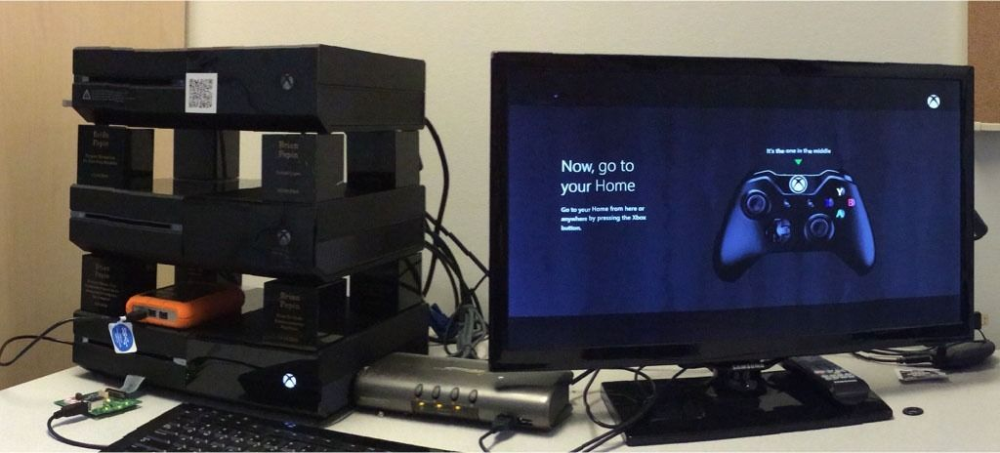

# Facet

The FACET port is a universal debugging port on all models of the Xbox One/Series-family.

Features:

- SPI / eMMC
- I2C
- Kernel Debugging
- Southbridge JTAG

A special development board is used to interact with this port.
Some early development kits have the FACET circuitry on-board and feature a female USB-B port for connecting directly to a PC.

## Connector

Label: J4E1 (Xbox One PHAT/Xbox One S) or J22 (Xbox One X)

Connector: IDC 2x13P 2.00mm

Pinout

- SPI -> eMMC
- SB_JTAG -> Southbridge JTAG
- SMC_DBG -> SMC SWO Debug
- KER_DBG -> Kernel Debugging
- SMBUS -> I2C

| Pin | Description      | Description | Pin |
| --- | ---------------- | ----------- | --- |
| 1   | SMC_RST_N        | GND         | 2   |
| 3   | SPI_MISO         | SPI_MOSI    | 4   |
| 5   | SPI_SS_N         | GND         | 6   |
| 7   | SPI_CLK          | GND         | 8   |
| 9   | SB_JTAG_TDI      | SB_JTAG_TDO | 10  |
| 11  | SB_JTAG_TMS      | GND         | 12  |
| 13  | SB_JTAG_TCK      | 3,3V STBY   | 14  |
| 15  | SMC_DBG_LED0_SWO | KER_DBG_CTS | 16  |
| 17  | KER_DBG_TXD      | KER_DBG_RTS | 18  |
| 19  | KER_DBG_RXD      | SMC_CTS     | 20  |
| 21  | SMC_TXD          | SMC_RTS     | 22  |
| 23  | SMC_RXD          | 3,3V STBY   | 24  |
| 25  | SMBUS_CLK        | SMBUS_DATA  | 26  |

### Xbox One PHAT

### Xbox One S

_Coming soon_

### Xbox One X

## External PCB

Model: FACET2 FAB A

Part #: X877922-001

Parts:

- FTDI FT4232
- EEPROM
- 4x 7-segment displays
- 7-Segment LED controller IC (I2C address 0x38)
- External SPI Device connector
- External JTAG Programmer connector
- Status LEDs

## Software

The DLL `dsmcdll.dll` is used to talk to the FACET-hardware.
## References

FACET2 PCB & smcdll.dll: [AssemblerGames archive](https://assemblergames.org/viewtopic.php?t=60058)
