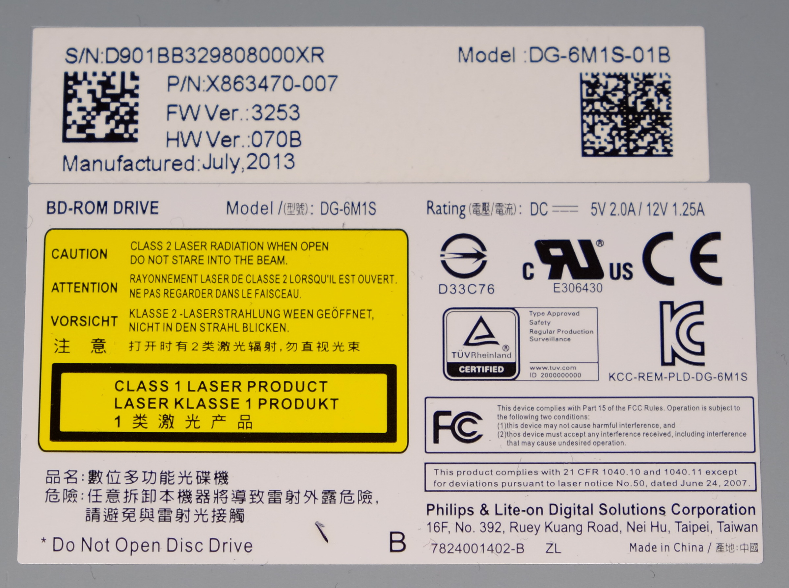
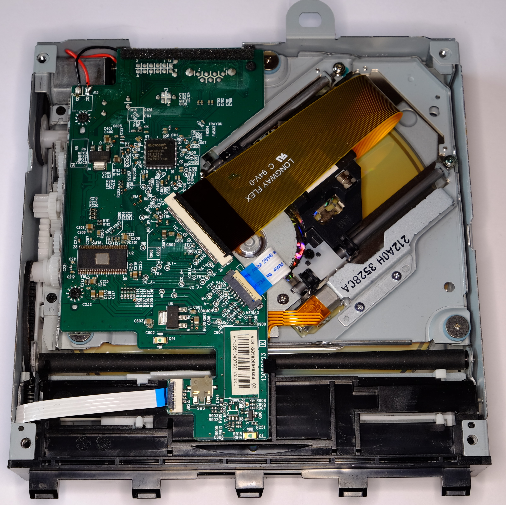
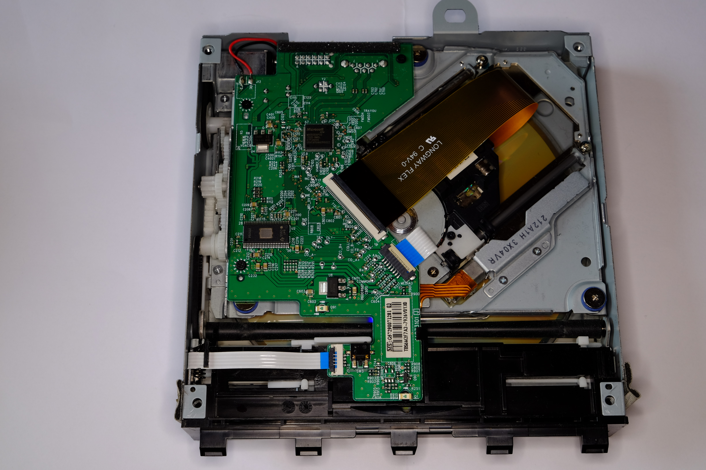
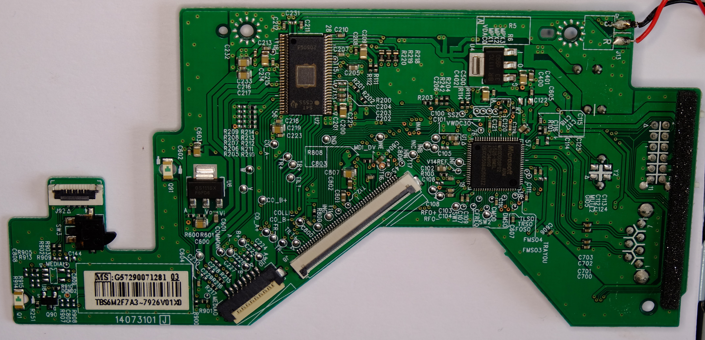

<!-- TITLE: Optical Disc Drive -->
<!-- SUBTITLE: Info about the optical disc drives used -->

# Xbox Optical disc drive

## Supported disc types in software
As of 2023 OS, the following different types of optical media are detected / differentiable by the Xbox:
```c#
public enum DetectedContentTypes : uint
{
	HasNothing = 0u,
	HasXboxOneGames = 1u,
	HasXbox360Games = 2u,
	HasDVDMovie = 4u,
	HasAudioTracks = 8u,
	HasDataTracks = 0x10u,
	HasAudioTracks_Undetermined = 0x20u,
	HasDataTracks_Undetermined = 0x40u,
	HasVideoCDMovie = 0x80u,
	HasSuperVideoCDMovie = 0x100u,
	HasDVDAudio = 0x200u,
	HasDCFPictures = 0x400u,
	HasBluRayMovie = 0x800u,
	HasXboxGames = 0x1000u
}
```

> This was discovered through inspection of the WinRT WinMetadata `Windows.Xbox.Management.Devices` found in C:\Windows\System32\WinMetadata\Windows.Xbox.winmd

## Game discs

Xbox One game discs are called [XGD4](../games/xbox-game-disc.md) (Xbox Game Disc Version 4).

## Drive models

The following optical disc drive models are known to date:

### Xbox One (PHAT)

  - Lite-On DG-6M1S-01B/02B/03B (Codename: ELK)
  - Lite-On DG-6M2S-01B (Codename: CORDOVA)

### Xbox One S / X

  - Lite-On DG-6M5S-01B/02B (Codename: MONTEREY)

## Lite-On drives

### General info

  - Seems to use MTK chipset
  - DG-6M1S is NOT detected when connected to a PC, all other models are

### Known firmware versions

  - 3253 (July 2013, DG-6M1S-01B)
  - 011V (August 2015, DG-6M2S-01B)
  - 017V (April 2016, DG-6M5S-01B)
  - 018V (November 2017, DG-6M5S-02B)

### Known flash chips

  - Lite-On DG-6M2S -\> MXIC(MX25L8091E) (MenuId: 0xC2, DevId1: 0x20,
    DevId2: 0x14)

### oddfwupd log

When a dashboard update performs a ODD firmware upgrade, a log file is
created on HDD.

**Location:** SystemSupport\\oddfwupd\\X.log (Where **X** is an increasing integer number indicating the update attempt count.)

For a compilation of different update logs in different situations, see the [ODD Firmware Update Log Page](odd-firmware-update-log.md).

## Philips / Lite-On PLDS DG-6M1S





## Philips / Lite-On PLDS DG-6M2S





