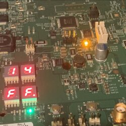
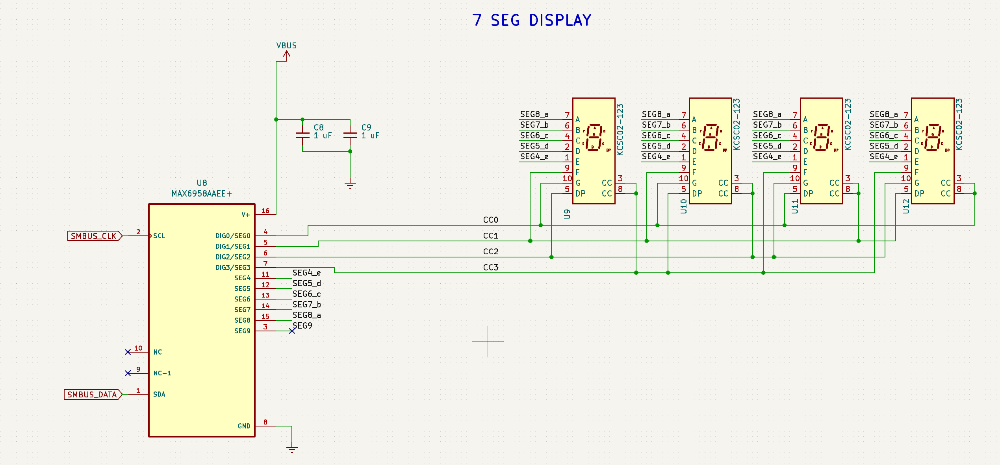

# POST

[POST](https://en.wikipedia.org/wiki/Power-on_self-test) codes on Xbox are sent by the southbridge via I2C to an *optional* MAX6958 IC to be displayed via 4x 7-Segment-Displays.

I2C Address: *0x38*

f.e. I2C SDA/SCL pads from [FACET connector](./facet.md) or [RF Unit](./rf-unit.md) can be used.

Website with POST / error codes: <https://xboxoneresearch.github.io/errorcodes>

## Schematic

## Reading POST codes

There is a minimalistic POST monitor implemented via Raspberry Pi Pico.
It simulates the MAX6958A I2C Slave and displays the gathered POST-codes via USB serial.

Soldering 3 wires (I2C and GND) is necessary.

Segments indicate the error-type.

| Mask | Name      |
| ---- | --------- |
| 0x10 | CPU       |
| 0x30 | PSP       |
| 0x70 | SMC       |
| 0xF0 | OS        |

See [Tools - PicoDurangoPOST](#tools)

## POST Codes

The following sections of POST / Error codes is not complete. It's extended whenever new codes are found.
Ideally it should be in sync with the [Errorcodes repository](#references)

### SMC

0SMCBL and 1SMCBL only output their progress to the ITM / ARM Cortex debug port (SWO).
Actual POST codes are output starting with ?2SMCBL?/SMCFW.

SMC code severity levels

| Level  | Code    |
| ------ | ------- |
| 0xE0xx | FATAL   |
| 0xE4xx | THERMAL |
| 0xEAxx | RESET   |
| 0xEBxx | BOOT    |
| 0xECxx | RUNTIME |

Post codes

| Code   | Name                               |
| ------ | ---------------------------------- |
|        | **SMC_FATAL**                      |
| 0xE001 | SMC_FATAL_V12                      |
| 0xE002 | SMC_FATAL_V5                       |
| 0xE003 | SMC_FATAL_V3P3_PWRGPA              |
| 0xE004 | SMC_FATAL_SBPOWERUP2               |
| 0xE005 | SMC_FATAL_CPUGFX_STARTUP_PWRGPB    |
| 0xE006 | SMC_FATAL_WIFI_UNRESET             |
| 0xE007 | SMC_FATAL_FAN_STARTUP              |
| 0xE008 | SMC_FATAL_SBPOWERUP1               |
| 0xE009 | SMC_FATAL_UNKNOWN                  |
| 0xE00A | SMC_FATAL_FAN_RUN                  |
| 0xE010 | SMC_FATAL_POWER_STABILIZE_RETRY    |
| 0xE011 | SMC_THERMAL_OVERTEMP_THRESHOLD     |
| 0xE046 | SMC_FATAL_GFXCPU_I2C_UNREACHABLE   |
| 0xE04B | SMC_FATAL_MEMIOCD                  |
| 0xE081 | SMC_FATAL_V12_HW_FAILURE           |
| 0xE082 | SMC_FATAL_V5_HW_FAILURE            |
| 0xE083 | SMC_FATAL_V3P3_HW_FAILURE          |
| 0xE084 | SMC_FATAL_CPUGFX_HW_FAILURE        |
| 0xE085 | SMC_FATAL_WIFI_HW_FAILURE          |
| 0xE086 | SMC_FATAL_WIFI_UNRESET             |
|        | **SMC_RESET**                      |
| 0xEA01 | SMC_RESET_PSPACK_MISSING           |
| 0xEA02 | SMC_RESET_FATAL_THERMAL_PENDING    |
| 0xEA03 | SMC_RESET_TIMEOUT                  |
| 0xEA04 | SMC_RESET_PIMACK_FAIL              |
| 0xEA05 | SMC_RESET_PIM_BOOT_INCOMPLETE      |
| 0xEA06 | SMC_RESET_BITMASK_INVALID          |
| 0xEAFF | SMC_RESET_INVALID_STATE            |
|        | **SMC_BOOT**                       |
| 0xEB40 | SMC_BOOT_SBUNRESETWAIT             |
| 0xEB41 | SMC_BOOT_PSPBOOTACKWAIT_DONE       |
| 0xEB42 | SMC_BOOT_PSPPORSPEWWAIT_DONE       |
| 0xEB43 | SMC_BOOT_SOCUNRESETWAIT_DONE       |
| 0xEB44 | SMC_BOOT_SOCFLASHACCWAIT           |
| 0xEB45 | SMC_BOOT_SOCPOST_DONE              |
| 0xEB46 | SMC_BOOT_UNKNOWN                   |
| 0xEB47 | SMC_BOOT_UNKNOWN                   |
| 0xEB48 | SMC_BOOT_SOCPOWEROK_DONE           |
| 0xEB49 | SMC_BOOT_XSSActiveWait_FAIL        |
|        | **SMC_RUNTIME**                    |
| 0xEC01 | SMC_RUNTIME_GET_SOCSyncFLOOD_STATE |
| 0xEC02 | SMC_RUNTIME_UNKNOWN                |
| 0xEC03 | SMC_RUNTIME_UNKNOWN                |
| 0xEC04 | SMC_RUNTIME_EXTPOST                |
| 0xEC05 | SMC_RUNTIME_UNKNOWN                |
| 0xEC06 | SMC_RUNTIME_UNKNOWN                |
| 0xEC07 | SMC_RUNTIME_UNKNOWN                |
| 0xEC09 | SMC_RUNTIME_GET_SBSystemSubmode    |
| 0xEC0B | SMC_RUNTIME_I2C_CLEARMSG           |
|        | **SMC_THERMAL**                    |
| 0xE422 | SMC_THERMAL_UNKNOWN                |
| 0xE423 | SMC_THERMAL_UNKNOWN                |
| 0xE424 | SMC_THERMAL_UNKNOWN                |
| 0xEC0E | SMC_RUNTIME_TIMEOUT                |

### SP

Security processor also outputs POST codes but due to the lack of binaries, these are unknown so far.

### 2BL

2BL outputs POST codes as a combination of Phase (high-byte) and Agesa testpoint (low-byte).

If low byte == `0xFF`, the phase is considered successful.

f.e.

- `14FF` is read as `0x14: Final`, `0xFF: EndAgesaTps`
- `04C5` is read as `0x04: AgesaEarlyInit`, `0xC5: TpAbl3ErrorDetected`

#### 2BL Phases

| Code | Phase                     |
| ---- | ------------------------- |
| 0x01 | Unknown                   |
| 0x02 | BlStartSmm                |
| 0x03 | BlCallAgesa_1             |
| 0x04 | AgesaEarlyInit            |
| 0x05 | BlCallAgesa_3             |
| 0x06 | AgesaHookBeforeC6Storage  |
| 0x07 | BlCallAgesa_4             |
| 0x08 | BlCallAgesa_5             |
| 0x09 | BlCallAgesa_6             |
| 0x0A | BlCallAgesa_7             |
| 0x0B | BlStartSouthBridgeDevices |
| 0x0C | Unknown_2                 |
| 0x0D | BlLoadVbi_1               |
| 0x0E | BlLoadVbi_2               |
| 0x0F | BlLoadVbi_3               |
| 0x10 | BlLoadVbi_4               |
| 0x11 | BlLoadVbi_5               |
| 0x12 | BlLoadVbi_6               |
| 0x13 | BlLoadVbi_7               |
| 0x14 | Final (aka end of BlMain) |

#### AGESA Abl Testpoints

| TP   | Name                                      | Description                                                                                 |
| ---- | ----------------------------------------- | ------------------------------------------------------------------------------------------- |
| 0x00 | StartProcessorTestPoints                  | 00 Entry used for range testing for @b Processor related TPs                                |
|      | **Memory test points**                    |                                                                                             |
| 0x01 | TpProcMemBeforeMemDataInit                | 01 .. Memory structure initialization (Public interface)                                    |
| 0x02 | TpProcMemBeforeSpdProcessing              | 02 .. SPD Data processing  (Public interface)                                               |
| 0x03 | TpProcMemAmdMemAuto                       | 03 .. Memory configuration  (Public interface)                                              |
| 0x04 | TpProcMemDramInit                         | 04 .. DRAM initialization                                                                   |
| 0x05 | TpProcMemSPDChecking                      | 05 ..                                                                                       |
| 0x06 | TpProcMemModeChecking                     | 06 ..                                                                                       |
| 0x07 | TpProcMemSpeedTclConfig                   | 07 .. Speed and TCL configuration                                                           |
| 0x08 | TpProcMemSpdTiming                        | 08 ..                                                                                       |
| 0x09 | TpProcMemDramMapping                      | 09 ..                                                                                       |
| 0x0a | TpProcMemPlatformSpecificConfig           | 0A ..                                                                                       |
| 0x0b | TPProcMemPhyCompensation                  | 0B ..                                                                                       |
| 0x0c | TpProcMemStartDcts                        | 0C ..                                                                                       |
| 0x0d | TpProcMemBeforeDramInit                   | 0D .. (Public interface)                                                                    |
| 0x0e | TpProcMemPhyFenceTraining                 | 0E ..                                                                                       |
| 0x0f | TpProcMemSynchronizeDcts                  | 0F ..                                                                                       |
| 0x10 | TpProcMemSystemMemoryMapping              | 10 ..                                                                                       |
| 0x11 | TpProcMemMtrrConfiguration                | 11 ..                                                                                       |
| 0x12 | TpProcMemDramTraining                     | 12 ..                                                                                       |
| 0x13 | TpProcMemBeforeAnyTraining                | 13 .. (Public interface)                                                                    |
| 0x14 | TpProcMemWriteLevelizationTraining        | 14 ..                                                                                       |
| 0x15 | TpProcMemWlFirstPass                      | 15 .. Below 800Mhz first pass start                                                         |
| 0x16 | TpProcMemWlSecondPass                     | 16 .. Above 800Mhz second pass start                                                        |
| 0x17 | TpProcMemWlTrainTargetDimm                | 17 .. Target DIMM configured                                                                |
| 0x18 | TpProcMemWlPrepDimms                      | 18 ..  Prepare DIMMS for WL                                                                 |
| 0x19 | TpProcMemWlConfigDimms                    | 19 ..  Configure DIMMS for WL                                                               |
| 0x1a | TpProcMemReceiverEnableTraining           | 1A ..                                                                                       |
| 0x1b | TpProcMemRcvrStartSweep                   | 1B .. Start sweep loop                                                                      |
| 0x1c | TpProcMemRcvrSetDelay                     | 1C .. Set receiver Delay                                                                    |
| 0x1d | TpProcMemRcvrWritePattern                 | 1D .. Write test pattern                                                                    |
| 0x1e | TpProcMemRcvrReadPattern                  | 1E .. Read test pattern                                                                     |
| 0x1f | TpProcMemRcvrTestPattern                  | 1F .. Compare test pattern                                                                  |
| 0x20 | TpProcMemRcvrCalcLatency                  | 20 .. Calculate MaxRdLatency per channel                                                    |
| 0x21 | TpProcMemReceiveDqsTraining               | 21 ..                                                                                       |
| 0x22 | TpProcMemRcvDqsSetDelay                   | 22 .. Set Write Data delay                                                                  |
| 0x23 | TpProcMemRcvDqsWritePattern               | 23 .. Write test pattern                                                                    |
| 0x24 | TpProcMemRcvDqsStartSweep                 | 24 .. Start read sweep                                                                      |
| 0x25 | TpProcMemRcvDqsSetRcvDelay                | 25 .. Set Receive DQS delay                                                                 |
| 0x26 | TpProcMemRcvDqsReadPattern                | 26 .. Read Test pattern                                                                     |
| 0x27 | TpProcMemRcvDqsTstPattern                 | 27 .. Compare Test pattern                                                                  |
| 0x28 | TpProcMemRcvDqsResults                    | 28 .. Update results                                                                        |
| 0x29 | TpProcMemRcvDqsFindWindow                 | 29 .. Start Find passing window                                                             |
|      | **Original Post code**                    |                                                                                             |
| 0x2a | TpProcMemTransmitDqsTraining              | 2A ..                                                                                       |
| 0x2b | TpProcMemTxDqStartSweep                   | 2B .. Start write sweep                                                                     |
| 0x2c | TpProcMemTxDqSetDelay                     | 2C .. Set Transmit DQ delay                                                                 |
| 0x2d | TpProcMemTxDqWritePattern                 | 2D .. Write test pattern                                                                    |
| 0x2e | TpProcMemTxDqReadPattern                  | 2E .. Read Test pattern                                                                     |
| 0x2f | TpProcMemTxDqTestPattern                  | 2F .. Compare Test pattern                                                                  |
| 0x30 | TpProcMemTxDqResults                      | 30 .. Update results                                                                        |
| 0x31 | TpProcMemTxDqFindWindow                   | 31 .. Start Find passing window                                                             |
| 0x32 | TpProcMemMaxRdLatencyTraining             | 32 ..                                                                                       |
| 0x33 | TpProcMemMaxRdLatStartSweep               | 33 .. Start sweep                                                                           |
| 0x34 | TpProcMemMaxRdLatSetDelay                 | 34 .. Set delay                                                                             |
| 0x35 | TpProcMemMaxRdLatWritePattern             | 35 .. Write test pattern                                                                    |
| 0x36 | TpProcMemMaxRdLatReadPattern              | 36 .. Read Test pattern                                                                     |
| 0x37 | TpProcMemMaxRdLatTestPattern              | 37 .. Compare Test pattern                                                                  |
| 0x38 | TpProcMemOnlineSpareInit                  | 38 .. Online Spare init                                                                     |
| 0x39 | TpProcMemBankInterleaveInit               | 39 .. Bank Interleave Init                                                                  |
| 0x3a | TpProcMemNodeInterleaveInit               | 3A .. Node Interleave Init                                                                  |
| 0x3b | TpProcMemChannelInterleaveInit            | 3B .. Channel Interleave Init                                                               |
| 0x3c | TpProcMemEccInitialization                | 3C .. ECC initialization                                                                    |
| 0x3d | TpProcMemPlatformSpecificInit             | 3D .. Platform Specific Init                                                                |
| 0x3e | TpProcMemBeforeAgesaReadSpd               | 3E .. Before callout for "AgesaReadSpd"                                                     |
| 0x3f | TpProcMemAfterAgesaReadSpd                | 3F .. After callout for "AgesaReadSpd"                                                      |
| 0x40 | TpProcMemBeforeAgesaHookBeforeDramInit    | 40 .. Before optional callout "AgesaHookBeforeDramInit"                                     |
| 0x41 | TpProcMemAfterAgesaHookBeforeDramInit     | 41 .. After optional callout "AgesaHookBeforeDramInit"                                      |
| 0x42 | TpProcMemBeforeAgesaHookBeforeDQSTraining | 42 .. Before optional callout "AgesaHookBeforeDQSTraining"                                  |
| 0x43 | TpProcMemAfterAgesaHookBeforeDQSTraining  | 43 .. After optional callout "AgesaHookBeforeDQSTraining"                                   |
| 0x44 | TpProcMemBeforeAgesaHookBeforeExitSelfRef | 44 .. Before optional callout "AgesaHookBeforeDramInit"                                     |
| 0x45 | TpProcMemAfterAgesaHookBeforeExitSelfRef  | 45 .. After optional callout "AgesaHookBeforeDramInit"                                      |
| 0x46 | TpProcMemAfterMemDataInit                 | 46 .. After MemDataInit                                                                     |
| 0x47 | TpProcMemInitializeMCT                    | 47 .. Before InitializeMCT                                                                  |
| 0x48 | TpProcMemLvDdr3                           | 48 .. Before LV DDR3                                                                        |
| 0x49 | TpProcMemInitMCT                          | 49 .. Before InitMCT                                                                        |
| 0x4a | TpProcMemOtherTiming                      | 4A.. Before OtherTiming                                                                     |
| 0x4b | TpProcMemUMAMemTyping                     | 4B .. Before UMAMemTyping                                                                   |
| 0x4c | TpProcMemSetDqsEccTmgs                    | 4C .. Before SetDqsEccTmgs                                                                  |
| 0x4d | TpProcMemMemClr                           | 4D .. Before MemClr                                                                         |
| 0x4e | TpProcMemOnDimmThermal                    | 4E .. Before On DIMM Thermal                                                                |
| 0x4f | TpProcMemDmi                              | 4F .. Before DMI                                                                            |
| 0x50 | TpProcMemEnd                              | 50 .. End of memory code                                                                    |
|      | **CPU test points**                       |                                                                                             |
| 0x51 | TpProcCpuEntryDmi                         | 51 .. Entry point CreateDmiRecords                                                          |
| 0x52 | TpProcCpuEntryPstate                      | 52 .. Entry point GenerateSsdt                                                              |
| 0x53 | TpProcCpuEntryPstateLeveling              | 53 .. Entry point PStateLeveling                                                            |
| 0x54 | TpProcCpuEntryPstateGather                | 54 .. Entry point PStateGatherData                                                          |
| 0x55 | TpProcCpuEntryWhea                        | 55 .. Entry point CreateAcpiWhea                                                            |
| 0x56 | TpProcCpuEntrySrat                        | 56 .. Entry point CreateAcpiSrat                                                            |
| 0x57 | TpProcCpuEntrySlit                        | 57 .. Entry point CreateAcpiSlit                                                            |
| 0x58 | TpProcCpuProcessRegisterTables            | 58 .. Register table processing                                                             |
| 0x59 | TpProcCpuSetBrandID                       | 59 .. Set brand ID                                                                          |
| 0x5a | TpProcCpuLocalApicInit                    | 5A .. Initialize local APIC                                                                 |
| 0x5b | TpProcCpuLoadUcode                        | 5B .. Load microcode patch                                                                  |
| 0x5c | TpProcCpuBeforePMFeatureInit              | 5C .. BeforePM feature dispatch point                                                       |
| 0x5d | TpProcCpuPowerMgmtInit                    | 5D .. Power Management table processing                                                     |
| 0x5e | TpProcCpuEarlyFeatureInit                 | 5E .. Early feature dispatch point                                                          |
| 0x5f | TpProcCpuCoreLeveling                     | 5F .. Core Leveling                                                                         |
| 0x60 | TpProcCpuApMtrrSync                       | 60 .. AP MTRR sync up                                                                       |
| 0x61 | TpProcCpuPostFeatureInit                  | 61 .. POST feature dispatch point                                                           |
| 0x62 | TpProcCpuFeatureLeveling                  | 62 .. CPU Feature Leveling                                                                  |
| 0x63 | TpProcCpuBeforeRelinquishAPsFeatureInit   | 63 .. Before Relinquishing control of APs feature dispatch point                            |
| 0x64 | TpProcCpuBeforeAllocateWheaBuffer         | 64 .. Before the WHEA init code calls out to allocate a buffer                              |
| 0x65 | TpProcCpuAfterAllocateWheaBuffer          | 65 .. After the WHEA init code calls out to allocate a buffer                               |
| 0x66 | TpProcCpuBeforeAllocateSratBuffer         | 66 .. Before the SRAT init code calls out to allocate a buffer                              |
| 0x67 | TpProcCpuAfterAllocateSratBuffer          | 67 .. After the SRAT init code calls out to allocate a buffer                               |
| 0x68 | TpProcCpuBeforeLocateSsdtBuffer           | 68 .. Before the P-state init code calls out to locate a buffer                             |
| 0x69 | TpProcCpuAfterLocateSsdtBuffer            | 69 .. After the P-state init code calls out to locate a buffer                              |
| 0x6a | TpProcCpuBeforeAllocateSsdtBuffer         | 6A .. Before the P-state init code calls out to allocate a buffer                           |
| 0x6b | TpProcCpuAfterAllocateSsdtBuffer          | 6B .. After the P-state init code calls out to allocate a buffer                            |
|      | **Topology test points**                  |                                                                                             |
| 0x71 | TpProcHtEntry                             | 71 .. Coherent Discovery begin (Public interface)                                           |
| 0x72 | TpProcHtTopology                          | 72 .. Topology match, routing, begin                                                        |
| 0x73 | TpProcHtManualNc                          | 73 .. Manual Non-coherent Init begin                                                        |
| 0x74 | TpProcHtAutoNc                            | 74 .. Automatic Non-coherent init begin                                                     |
| 0x75 | TpProcHtOptGather                         | 75 .. Optimization: Gather begin                                                            |
| 0x76 | TpProcHtOptRegang                         | 76 .. Optimization: Regang begin                                                            |
| 0x77 | TpProcHtOptLinks                          | 77 .. Optimization: Link Begin                                                              |
| 0x78 | TpProcHtOptSubLinks                       | 78 .. Optimization: Sublinks begin                                                          |
| 0x79 | TpProcHtOptFinish                         | 79 .. Optimization: Set begin                                                               |
| 0x7a | TpProcHtTrafficDist                       | 7A .. Traffic Distribution begin                                                            |
| 0x7b | TpProcHtTuning                            | 7B .. Misc Tuning Begin                                                                     |
| 0x7c | TpProcHtDone                              | 7C .. HT Init complete                                                                      |
| 0x7d | TpProcHtApMapEntry                        | 7D .. AP HT: Init Maps begin                                                                |
| 0x7e | TpProcHtApMapDone                         | 7E .. AP HT: Complete                                                                       |
|      | **Extended memory test point**            |                                                                                             |
| 0x80 | TpProcMemSendMRS2                         | 80 .. Sending MRS2                                                                          |
| 0x81 | TpProcMemSendMRS3                         | 81 .. Sedding MRS3                                                                          |
| 0x82 | TpProcMemSendMRS1                         | 82 .. Sending MRS1                                                                          |
| 0x83 | TpProcMemSendMRS0                         | 83 .. Sending MRS0                                                                          |
| 0x84 | TpProcMemContinPatternGenRead             | 84 .. Continuous Pattern Read                                                               |
| 0x85 | TpProcMemContinPatternGenWrite            | 85 .. Continuous Pattern Write                                                              |
| 0x86 | TpProcMem__RdDqsTraining                  | 86 .. Mem: RdDqs Training begin                                                             |
| 0x87 | TpProcMemBefore__TrainExtVrefChange       | 87 .. Mem: Before optional callout to platfrom BIOS to change External Vref during training |
| 0x88 | TpProcMemAfter__TrainExtVrefChange        | 88 .. Mem: After optional callout to platfrom BIOS to change External Vref during training  |
|      | **Gnb Earlier init**                      |                                                                                             |
| 0x90 | StartNbTestPoints                         | 90 Entry used for range testing for @b NorthBridge related TPs                              |
| 0x91 | TpNbxxx                                   | 91 .                                                                                        |
| 0x92 | EndNbTestPoints                           | 92 End of TP range for NB                                                                   |
|      | **FCH testpoints**                        |                                                                                             |
| 0xb0 | StartFchTestPoints                        | B0 Entry used for range testing for @b FCH related TPs                                      |
| 0xb1 | TpFchInitResetDispatching                 | B1 .. FCH InitReset dispatch point                                                          |
| 0xb2 | TpFchGppBeforePortTraining                | B2 .. Before FCH GPP port training                                                          |
| 0xb3 | TpFchGppGen1PortPolling                   | B3 .. FCH GPP port polling with GEN1 speed                                                  |
| 0xb4 | TpFchGppGen2PortPolling                   | B4 .. FCH GPP port polling with GEN2 speed                                                  |
| 0xb5 | TpFchGppAfterPortTraining                 | B5 .. After FCH GPP port training                                                           |
| 0xb6 | TpFchInitEnvDispatching                   | B6 .. FCH InitEnv dispatch point                                                            |
| 0xb7 | TpFchInitMidDispatching                   | B7 .. FCH InitMid dispatch point                                                            |
| 0xb8 | TpFchInitLateDispatching                  | B8 .. FCH InitLate dispatch point                                                           |
| 0xb9 | TpFchGppHotPlugging                       | B9 .. FCH GPP hot plug event                                                                |
| 0xba | TpFchGppHotUnplugging                     | BA .. AFCH GPP hot unplug event                                                             |
| 0xbb | TpFchInitS3EarlyDispatching               | BB .. FCH InitS3Early dispatch point                                                        |
| 0xbc | TpFchInitS3LateDispatching                | BC .. FCH InitS3Late dispatch point                                                         |
| 0xbd | EndFchTestPoints                          | BF End of TP range for FCH                                                                  |
| 0xc0 | TpIfAmdInitResetEntry                     | C0 .. Entry to AmdInitReset                                                                 |
| 0xc1 | TpIfAmdInitResetExit                      | C1 .. Exiting from AmdInitReset                                                             |
| 0xc2 | TpIfAmdInitRecoveryEntry                  | C2 .. Entry to AmdInitRecovery                                                              |
| 0xc3 | TpIfAmdInitRecoveryExit                   | C3 .. Exiting from AmdInitRecovery                                                          |
| 0xc4 | TpIfAmdInitEarlyEntry                     | C4 .. Entry to AmdInitEarly                                                                 |
| 0xc5 | TpIfAmdInitEarlyExit                      | C5 .. Exiting from AmdInitEarly                                                             |
| 0xc6 | TpIfAmdInitPostEntry                      | C6 .. Entry to AmdInitPost                                                                  |
| 0xc7 | TpIfAmdInitPostExit                       | C7 .. Exiting from AmdInitPost                                                              |
| 0xc8 | TpIfAmdInitEnvEntry                       | C8 .. Entry to AmdInitEnv                                                                   |
| 0xc9 | TpIfAmdInitEnvExit                        | C9 .. Exiting from AmdInitEnv                                                               |
| 0xca | TpIfAmdInitMidEntry                       | CA .. Entry to AmdInitMid                                                                   |
| 0xcb | TpIfAmdInitMidExit                        | CB .. Exiting from AmdInitMid                                                               |
| 0xcc | TpIfAmdInitLateEntry                      | CC .. Entry to AmdInitLate                                                                  |
| 0xcd | TpIfAmdInitLateExit                       | CD .. Exiting from AmdInitLate                                                              |
| 0xce | TpIfAmdS3SaveEntry                        | CE .. Entry to AmdS3Save                                                                    |
| 0xcf | TpIfAmdS3SaveExit                         | CF .. Exiting from AmdS3Save                                                                |
| 0xd0 | TpIfAmdInitResumeEntry                    | D0 .. Entry to AmdInitResume                                                                |
| 0xd1 | TpIfAmdInitResumeExit                     | D1 .. Exiting from AmdInitResume                                                            |
| 0xd2 | TpIfAmdS3LateRestoreEntry                 | D2 .. Entry to AmdS3LateRestore                                                             |
| 0xd3 | TpIfAmdS3LateRestoreExit                  | D3 .. Exiting from AmdS3LateRestore                                                         |
| 0xd4 | TpIfAmdLateRunApTaskEntry                 | D4 .. Entry to AmdS3LateRestore                                                             |
| 0xd5 | TpIfAmdLateRunApTaskExit                  | D5 .. Exiting from AmdS3LateRestore                                                         |
| 0xd6 | TpIfAmdReadEventLogEntry                  | D6 .. Entry to AmdReadEventLog                                                              |
| 0xd7 | TpIfAmdReadEventLogExit                   | D7 .. Exiting from AmdReadEventLog                                                          |
| 0xd8 | TpIfAmdGetApicIdEntry                     | D8 .. Entry to AmdGetApicId                                                                 |
| 0xd9 | TpIfAmdGetApicIdExit                      | D9 .. Exiting from AmdGetApicId                                                             |
| 0xda | TpIfAmdGetPciAddressEntry                 | DA .. Entry to AmdGetPciAddress                                                             |
| 0xdb | TpIfAmdGetPciAddressExit                  | DB .. Exiting from AmdGetPciAddress                                                         |
| 0xdc | TpIfAmdIdentifyCoreEntry                  | DC .. Entry to AmdIdentifyCore                                                              |
| 0xdd | TpIfAmdIdentifyCoreExit                   | DD .. Exiting from AmdIdentifyCore                                                          |
| 0xde | TpIfBeforeRunApFromIds                    | DE .. After IDS calls out to run code on an AP                                              |
| 0xdf | TpIfAfterRunApFromIds                     | DF .. After IDS calls out to run code on an AP                                              |
| 0xe0 | TpIfBeforeGetIdsData                      | E0 .. Before IDS calls out to get IDS data                                                  |
| 0xe1 | TpIfAfterGetIdsData                       | E1 .. After IDS calls out to get IDS data                                                   |
| 0xe2 | TpIfBeforeAllocateHeapBuffer              | E2 .. Before the heap manager calls out to allocate a buffer                                |
| 0xe3 | TpIfAfterAllocateHeapBuffer               | E3 .. After the heap manager calls out to allocate a buffer                                 |
| 0xe4 | TpIfBeforeDeallocateHeapBuffer            | E4 .. Before the heap manager calls out to deallocate a buffer                              |
| 0xe5 | TpIfAfterDeallocateHeapBuffer             | E5 .. After the heap manager calls out to deallocate a buffer                               |
| 0xe6 | TpIfBeforeLocateHeapBuffer                | E6 .. Before the heap manager calls out to locate a buffer                                  |
| 0xe7 | TpIfAfterLocateHeapBuffer                 | E7 .. After the heap manager calls out to locate a buffer                                   |
| 0xe8 | TpIfBeforeRunApFromAllAps                 | E8 .. Before the BSP calls out to run code on an AP                                         |
| 0xe9 | TpIfAfterRunApFromAllAps                  | E9 .. After the BSP calls out to run code on an AP                                          |
| 0xea | TpIfBeforeRunApFromAllCore0s              | EA .. Before the BSP calls out to run code on an AP                                         |
| 0xeb | TpIfAfterRunApFromAllCore0s               | EB .. After the BSP calls out to run code on an AP                                          |
| 0xec | TpIfBeforeAllocateS3SaveBuffer            | EC .. Before the S3 save code calls out to allocate a buffer                                |
| 0xed | TpIfAfterAllocateS3SaveBuffer             | ED .. After the S3 save code calls out to allocate a buffer                                 |
| 0xee | TpIfBeforeAllocateMemoryS3SaveBuffer      | EE .. Before the memory S3 save code calls out to allocate a buffer                         |
| 0xef | TpIfAfterAllocateMemoryS3SaveBuffer       | EF .. After the memory S3 save code calls out to allocate a buffer                          |
| 0xf0 | TpIfBeforeLocateS3PciBuffer               | F0 .. Before the memory code calls out to locate a buffer                                   |
| 0xf1 | TpIfAfterLocateS3PciBuffer                | F1 .. After the memory code calls out to locate a buffer                                    |
| 0xf2 | TpIfBeforeLocateS3CPciBuffer              | F2 .. Before the memory code calls out to locate a buffer                                   |
| 0xf3 | TpIfAfterLocateS3CPciBuffer               | F3 .. After the memory code calls out to locate a buffer                                    |
| 0xf4 | TpIfBeforeLocateS3MsrBuffer               | F4 .. Before the memory code calls out to locate a buffer                                   |
| 0xf5 | TpIfAfterLocateS3MsrBuffer                | F5 .. After the memory code calls out to locate a buffer                                    |
| 0xf6 | TpIfBeforeLocateS3CMsrBuffer              | F6 .. Before the memory code calls out to locate a buffer                                   |
| 0xf7 | TpIfAfterLocateS3CMsrBuffer               | F7 .. After the memory code calls out to locate a buffer                                    |
| 0xf8 | TpPerfUnit                                | F8 .. The Unit of performance measure.                                                      |
| 0xff | EndAgesaTps                               | Last defined AGESA TP                                                                       |

## Tools

- [PicoDurangoPOST](https://github.com/xboxoneresearch/PicoDurangoPOST)

## References

- [Error codes website](https://xboxoneresearch.github.io/errorcodes)
- [POST/Error Codes repository](https://github.com/xboxoneresearch/errorcodes)
- [Consolemods.org wiki](https://consolemods.org/wiki/Xbox_One:POST_Code_Diagnosis)
- [MAX6958 Datasheet](https://www.analog.com/en/products/max6958.html)
- [MAX6958 Display module](https://oshwlab.com/marten_7544/max6958) - Open source design by Martin Feldtmann
- [AGESA Abl Post-Codes](https://github.com/librecore-org/librecore/blob/be8399c4583ecccbfb3bde53a0b7fd508fa04e9b/src/vendorcode/amd/agesa/f15/Include/Ids.h#L647)