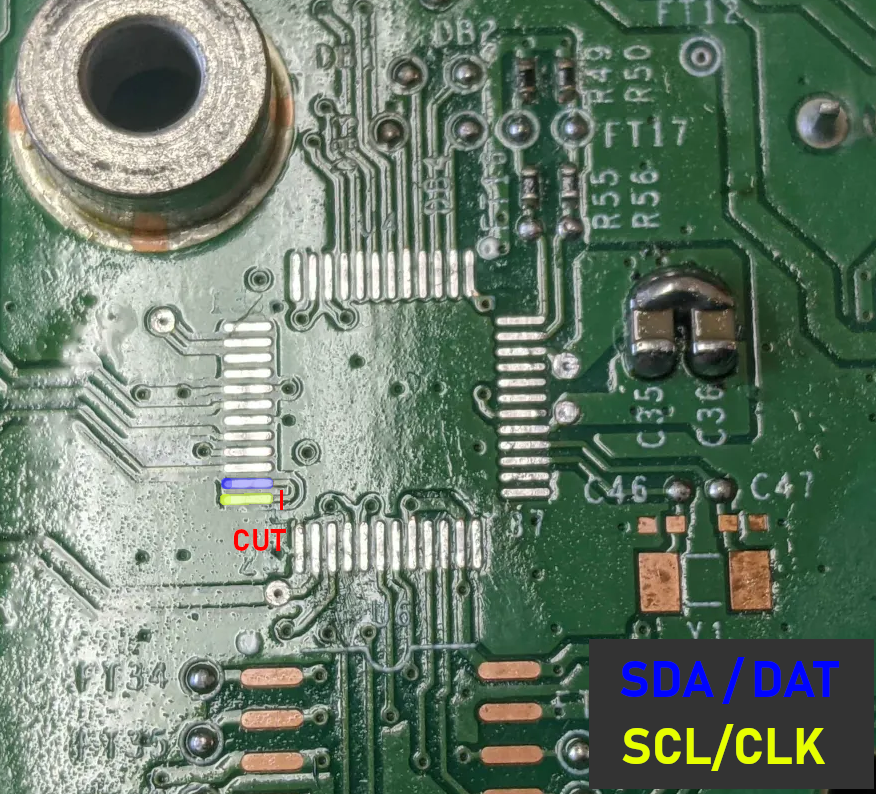

# RF Unit

## Info

### Xbox One (PHAT)

Part Number: X867281-005
Codename: Lithium

Components:

- Infrared Receiver (U1)
- Soundchip - ISD9160F (U4)
- Connector to sound speaker (J1)
- Wifi Antenna connector (J2)
- FPC connector (J3)
- Motherboard connector (J8)
- Unpopulated (SW2)

####  General

The RF Unit, compared to Xbox 360, is very simple. It does not contain any RF hardware onboard.
It only contains an IR Receiver, the Nuvoton Soundcorder Chip (which also handles button presses from the front panel touch buttons) and an internal antenna.
Actual RF communication is happening via a [Wifi module](wifi.md).

Communication from the Nuvotun chip to the Southbridge is done via I2C.
The Nuvoton chip itself also supports ARM SWD!

#### Firmwares

So far, three different firmwares have been seen

(SHA256 hash is over 0x24400 bytes)

```
# RETAIL

SHA256: abc699513959372faee038c78a1d7509c2020f65cb78ad07ab9c90b21b406a87

ISD-VPE Ver 920.000c 08/05/2013 PV_Prod_Units_Rev5 VERSION:0x10000007
ISD9160FIMS03 FW Jun 14 2013 at 10:41:12 (C) Nuvoton 2013
Nuvoton ISD9160MS Boot FW Jun 14 2013 10:40:21 
Nuvoton ISD9160MS Boot FW Jun 14 2013 10:40:21 

# EV3B

SHA256: 7fd817a51086ba9089ce04168f73fdf753aedcbb2f63a19b3ff7be06e668a8e1

ISD-VPE Ver 920.0008 04/06/2013 EV3B_Prod_Units_Rev1 VERSION:0x10000003 Release 1.0
ISD9160FIMS03 FW Jun 14 2013 at 10:41:12 (C) Nuvoton 2013
Nuvoton ISD9160MS Boot FW Jun 14 2013 10:40:21 
Nuvoton ISD9160MS Boot FW Feb  1 2013 15:17:36

# TACOBELL

SHA256: c39871fcfef69c632955658f8e876d35a35dafb9c88c7fc082dca23d2102289f

ISD-VPE Ver 930.0000 03/19/2018 PV_MASA_V4 VERSION:0x10000007
ISD9160FIMS05 I2C Jan 12 2015 at 14:09:09 (C) Nuvoton 2015
Nuvoton ISD9160MS Boot FW Jun 14 2013 10:40:21 
Nuvoton ISD9160MS Boot FW Jun 14 2013 10:40:21
```

#### Connector (J8)

Pinout

| Pin| Function        |
|----|-----------------|
|  1 | LED Nexus       |
|  2 | LED Halo        |
|  3 | LED Zone        |
|  4 | 5V (VCC)        |
|  5 | I2C CLK         |
|  6 | I2C DATA        |
|  7 | IR Data         |
|  8 | PWR Switch (N)  |
|  9 | GND             |
| 10 | EJECT Switch (N)|
| 11 | INT_N           |
| 12 | 3,3V STDBY      |
| 13 | BIND Switch (N) |
| 14 | GND             |
| 15 | -               |
| 16 | -               |
| 17 | -               |
| 18 | GND             |
| 19 | GND             |

#### FPC Connector (J3)

Pinout

| Pin | Function | ISD9160F Pin |
| ----| ---------| -------------|
| 1   |  Power   |            9 |
| 2   |  Power   |            8 |
| 3   |  -       |             -|
| 4   |  -       |             -|
| 5   |  -       |             -|
| 6   |  Eject   |            7 |
| 7   |  Eject   |            6 |

Bridge the respective pins briefly to trigger action.

FPC Cable / capacitive front panel buttons are directly wired to the ISD-Chip.

#### Nuvoton Soundcorder chip (U4)

Responsible for playing the power-on/off and eject sounds.

Model: ISD9160F

Datasheet: [ISD9160FI](../_files/rf-unit/1811151450_Nuvoton-Tech-ISD9160FI_C79806.pdf)

Pinout (from the official datasheet linked above)


This IC has multiple possible pin-configurations, the following are verified signals.

| Pin | Function                   |
| --- | -------------------------- |
|   6 | Eject button (FPC - Pin 7) |
|   7 | Eject button (FPC - Pin 6) |
|   8 | Power button (FPC - Pin 2) |
|   9 | Power button (FPC - Pin 1) |
|  47 | I2C SCL (CLK)              |
|  46 | I2C SDA (DAT)              |

##### Reading and Writing the chip via SWD

Alternatively to I2C, the ARM SWD protocol can be used to read/write the chip.

Requirements:

Software

- Linux
- OpenOCD build, patched for ISD9160 support (see https://github.com/xboxoneresearch/DuRFUnitI2C/releases/tag/openocd_build)
- Debugprobe firmware for PiPico (debugprobe_on_pico/2.uf2) - https://github.com/raspberrypi/debugprobe/releases

Hardware

- Raspberry Pi Pico/2
- Soldering equipment
- Sharp tweezers

By default, the required pins on the IC are bridged on the RF Unit PCB. To enable usage of SWD, a trace needs to be cut, using pointy tweezers for example. 

Make sure to use a multimeter to confirm the trace was cut properly.



Steps:

- Do the trace-cut mentioned above
- Flash debugprobe firmware on Pi Pico/2
- Connect Pi Pico to ISD9160 SWD pins (see https://mcuoneclipse.com/2022/09/17/picoprobe-using-the-raspberry-pi-pico-as-debug-probe/), 3V3 and GND
- Now extract and start OpenOCD

```
tar xvf openocd_isd9160.tar.gz
cd openocd_isd9160/
./bin/openocd -f ./share/openocd/scripts/interface/cmsis-dap.cfg -f ./share/openocd/scripts/target/numicro.cfg
```

- In another terminal window connect via telnet

```
telnet localhost 4444
```

- First, dump the original `APROM` firmware

```
flash read_bank 0 aprom_original.bin
```

- Now, erase the bank and write new `APROM` firmware

```
flash erase_sector 0 0 last
flash write_bank 0 aprom_new.bin
```

- Profit

##### I2C

Captured via Logic Analyzer from Pin 5,6 on RF Unit.

I2C address: `0x5A`

Commands

| Byte | Name           | Args           | Reads data |
| ---- | -------------- | -------------- | ---------- |
| 0x48 | Register Write | Register, Data | No         |
| 0xC0 | Interrupt Read | /              | Yes        |
| 0xC1 | Register Read  | /              | Yes        |
| 0xC3 | Flash Read     | Address U32-LE | Yes        |
| 0x81 | Start Sound    | Sound index    | No         |
| 0x02 | Stop Sound     | /              | No         |
| 0x42 | Reset          | 0x55           | No         |

Registers

| Num  | Name     | Read/Write |
| ---- | -------- | ---------- |
| 0x0C | Status   | READ-ONLY  |
| 0x04 | Address0 | R/W        |

Available sounds

| Index| Name         |
| ---- | ------------ |
| 0x00 | PowerOn      |
| 0x01 | Ding         |
| 0x02 | PowerOff     |
| 0x03 | DiscDrive1   |
| 0x04 | DiscDrive2   |
| 0x05 | DiscDrive3   |
| 0x06 | Plopp        |
| 0x07 | No Disc      |
| 0x08 | Plopp Louder |

Init sequence:

```
WRITE [CMD_REGISTER_WRITE, REG_STATUS, 0x01]
WRITE [CMD_REGISTER_WRITE, REG_ADDR0, 0xFF, 0xFF]
```

Play sound

```
WRITE [CMD_START, SOUND_INDEX]
```

Stop sound

```
WRITE [CMD_STOP]
```

Reset

```
WRITE [CMD_RESET, 0x55]
```

Write register

```
WRITE [CMD_REGISTER_WRITE, <REGISTER>, <DATA>]
```

Read register

```
WRITE [CMD_REGISTER_READ, <REGISTER>]
READ <DATA>
```

Read interrupt

```
WRITE [CMD_INTERRUPT_READ]
READ <DATA>
```

Flash read

```
WRITE [CMD_FLASH_READ, <Address as UINT32, little endian>]
READ <DATA> (8 bytes)
* Cut off first 2 bytes to yield 6 bytes of flash data
```

To get a sound playing, this is the full flow done by the console

```
- Init
- Stop
- Play sound
```

### Xbox One S

Codename: Sodium

#### Pinout

Connector

| Pin| Function        |
|----|-----------------|
|  1 | LED Nexus       |
|  2 | -               |
|  3 | IR Blaster      |
|  4 | PWR Switch (N)  |
|  5 | EJECT Switch (N)|
|  6 | INT_N           |
|  7 | 3,3V STDBY      |
|  8 | 5V              |
|  9 | ACC_RESET       |
| 10 | IR (RX)         |
| 11 | GND             |
| 12 | USB2 (-)        |
| 13 | USB2 (+)        |
| 14 | GND             |
| 15 | I2C CLK         |
| 16 | I2C DATA        |

### Xbox One X

Codename: Cactus

**NOTE**: Front panel on Xbox One X does not use I2C anymore.

#### Pinout

| Pin| Function        |
|----|-----------------|
|  1 | IR (RX)         |
|  2 | EJECT Switch (N)|
|  3 | -               |
|  4 | IR Blaster      |
|  5 | ACC_RESET       |
|  6 | GND             |
|  7 | USB2 (-)        |
|  8 | USB2 (+)        |
|  9 | 3,3V STDBY      |
| 10 | GND             |
| 11 | -               |
| 12 | -               |
| 13 | -               |
| 14 | PWR Switch (N)  |
| 15 | LED Nexus       |
| 16 | 5V              |

## Pictures
### Xbox One (PHAT)


### Xbox One S


### Xbox One X (SCORPIO)

[](../_files/rf-unit/rf_unit_onex_front.jpg)
[](../_files/rf-unit/rf_unit_onex_back.jpg)
[](../_files/rf-unit/rf_unit_onex_front_detailed.jpg)

## Tools

- [DuRFUnitI2C](https://github.com/xboxoneresearch/DuRFUnitI2C) - (Python) Communicate with the (PHAT) RF Unit and dump its flash
## Credits
- [Xbox One PHAT and One S Pictures from ifixit.com](https://www.ifixit.com/Search?c-doctype_namespace=product&doctype=product&query=xbox%20one)
- Xbox One X Pictures taken by jacksomness
