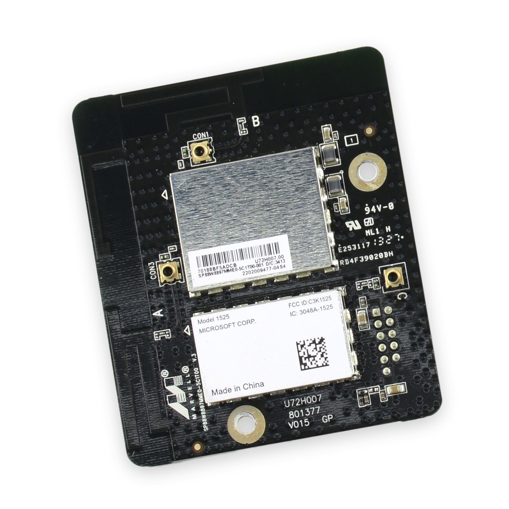
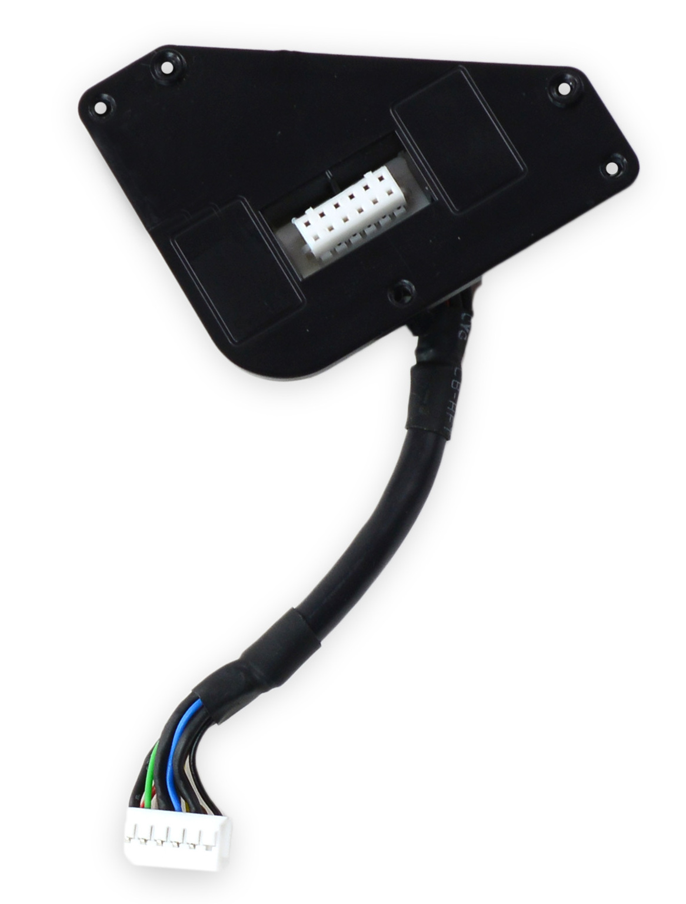
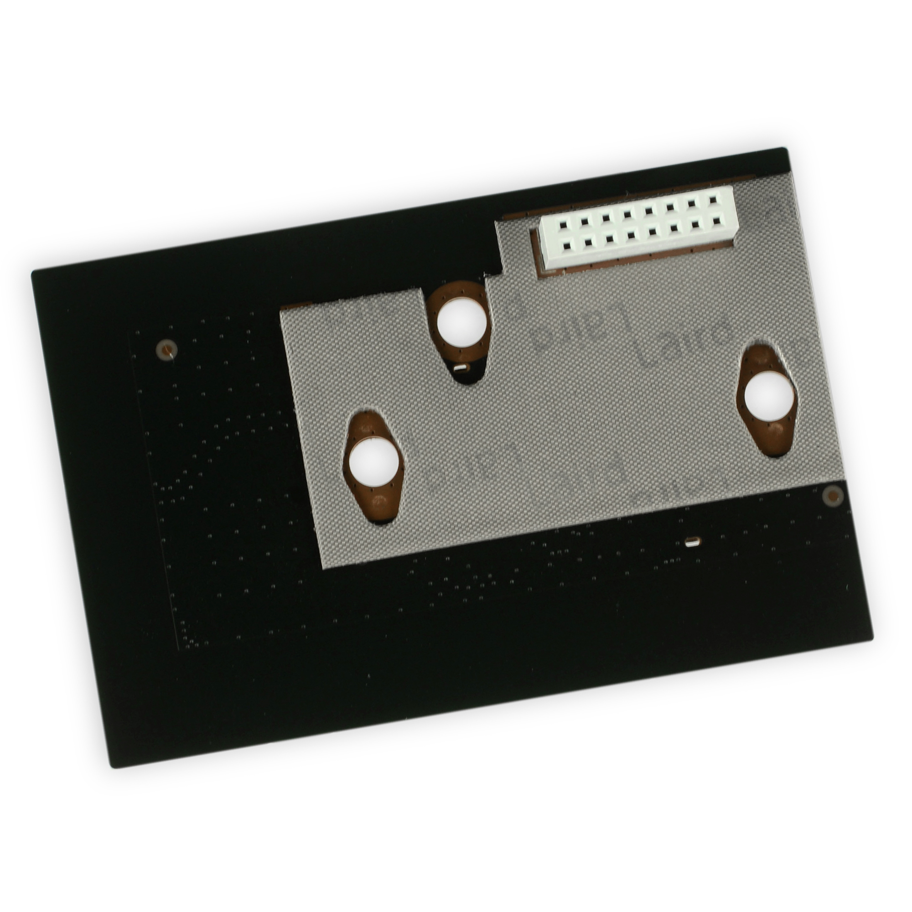
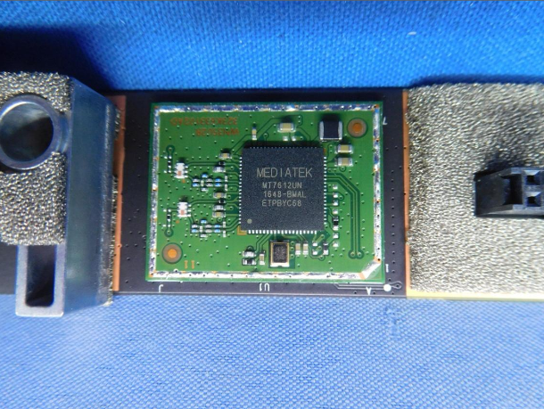

# Wifi

## Xbox One
First revision of the Xbox One has both chipsets on the same PCB, a 8-pin connection goes from the PCB to the motherboard.

Communication is via 2x USB data-pairs.
**IMPORTANT**: The board is operated via 3,3V, standard USB is 5V!

USB VID: 0x1286

- Marvell Avastar 88W8897 (PID 0x2045)
- Marvell Avastar 88W8782U (PID 0x2040)

Both chips require a firmware blob to be uploaded.

### Pinout

- (A / CON3) U.FL - To RF Unit
- (B / CON1) U.FL - NC
- (C / CON2) U.FL - NC

- JST 2x6 Pin connector (JST PHD 2X6P, 2.00mm)

JST Pinout

| Pin | Description  | Pin | Description  |
| --- | ------------ | --- | ------------ |
| 1   | 3,3V         | 2   | GND          |
| 3   | USB2_ACC_DP  | 4   | USB_ACC_DM   |
| 5   | GND          | 6   | GND          |
| 7   | USB2_WIFI_DP | 8   | USB2_WIFI_DM |
| 9   | RESET_N      | 10  | GND          |
| 11  | 3,3V         | 12  | /            |


To use the module on a regular USB Port (On PC):

Requires 2x 1N4148 diodes per interface.

Safer alternative 5V->3,3V LDO

```
USB Host 5V --- 1N4148 | -- 1N4148 | -- 3,3V
USB Host D+ --- USB2_*_DP
USB Host D- --- USB2_*_DM
USB Host GND -- GND
```

### Interfaces

USB2_ACC - 88W8782U - Connectivity for accessories / game-controllers

lsusb (verbose) - Before firmware upload

```
Bus 001 Device 070: ID 1286:2040 Marvell Semiconductor, Inc. Marvell Wireless Device
Device Descriptor:
  bLength                18
  bDescriptorType         1
  bcdUSB               2.00
  bDeviceClass            0 [unknown]
  bDeviceSubClass         0 [unknown]
  bDeviceProtocol         0 
  bMaxPacketSize0        64
  idVendor           0x1286 Marvell Semiconductor, Inc.
  idProduct          0x2040 Marvell Wireless Device
  bcdDevice           31.19
  iManufacturer           1 Marvell
  iProduct                2 Marvell Wireless Device
  iSerial                 3 0000000000000000
  bNumConfigurations      1
  Configuration Descriptor:
    bLength                 9
    bDescriptorType         2
    wTotalLength       0x003c
    bNumInterfaces          1
    bConfigurationValue     1
    iConfiguration          4 Wireless LAN Configuration
    bmAttributes         0xa0
      (Bus Powered)
      Remote Wakeup
    MaxPower              500mA
    Interface Descriptor:
      bLength                 9
      bDescriptorType         4
      bInterfaceNumber        0
      bAlternateSetting       0
      bNumEndpoints           6
      bInterfaceClass       255 Vendor Specific Class
      bInterfaceSubClass    255 Vendor Specific Subclass
      bInterfaceProtocol    255 Vendor Specific Protocol
      iInterface              5 Wireless LAN Interface
      Endpoint Descriptor:
        bLength                 7
        bDescriptorType         5
        bEndpointAddress     0x01  EP 1 OUT
        bmAttributes            2
          Transfer Type            Bulk
          Synch Type               None
          Usage Type               Data
        wMaxPacketSize     0x0200  1x 512 bytes
        bInterval               0
      Endpoint Descriptor:
        bLength                 7
        bDescriptorType         5
        bEndpointAddress     0x81  EP 1 IN
        bmAttributes            2
          Transfer Type            Bulk
          Synch Type               None
          Usage Type               Data
        wMaxPacketSize     0x0200  1x 512 bytes
        bInterval               0
      Endpoint Descriptor:
        bLength                 7
        bDescriptorType         5
        bEndpointAddress     0x02  EP 2 OUT
        bmAttributes            2
          Transfer Type            Bulk
          Synch Type               None
          Usage Type               Data
        wMaxPacketSize     0x0200  1x 512 bytes
        bInterval               0
      Endpoint Descriptor:
        bLength                 7
        bDescriptorType         5
        bEndpointAddress     0x82  EP 2 IN
        bmAttributes            2
          Transfer Type            Bulk
          Synch Type               None
          Usage Type               Data
        wMaxPacketSize     0x0200  1x 512 bytes
        bInterval               0
      Endpoint Descriptor:
        bLength                 7
        bDescriptorType         5
        bEndpointAddress     0x03  EP 3 OUT
        bmAttributes            2
          Transfer Type            Bulk
          Synch Type               None
          Usage Type               Data
        wMaxPacketSize     0x0200  1x 512 bytes
        bInterval               0
      Endpoint Descriptor:
        bLength                 7
        bDescriptorType         5
        bEndpointAddress     0x83  EP 3 IN
        bmAttributes            2
          Transfer Type            Bulk
          Synch Type               None
          Usage Type               Data
        wMaxPacketSize     0x0200  1x 512 bytes
        bInterval               0
Device Qualifier (for other device speed):
  bLength                10
  bDescriptorType         6
  bcdUSB               2.00
  bDeviceClass            0 [unknown]
  bDeviceSubClass         0 [unknown]
  bDeviceProtocol         0 
  bMaxPacketSize0        64
  bNumConfigurations      1
Device Status:     0x0000
  (Bus Powered)
```

After firmware upload (Firmware Blob: `mv14u8782.bin`)

```
Bus 001 Device 120: ID 045e:02ce Microsoft Corp. Embedded Wireless Adapter
Device Descriptor:
  bLength                18
  bDescriptorType         1
  bcdUSB               2.00
  bDeviceClass            0 [unknown]
  bDeviceSubClass         0 [unknown]
  bDeviceProtocol         0 
  bMaxPacketSize0        64
  idVendor           0x045e Microsoft Corp.
  idProduct          0x02ce Embedded Wireless Adapter
  bcdDevice           31.17
  iManufacturer           1 Marvell
  iProduct                2 Embedded Wireless Adapter
  iSerial                 3 342387D162E1
  bNumConfigurations      1
  Configuration Descriptor:
    bLength                 9
    bDescriptorType         2
    wTotalLength       0x003c
    bNumInterfaces          1
    bConfigurationValue     1
    iConfiguration          4 Dual Band Accessory Master
    bmAttributes         0xe0
      Self Powered
      Remote Wakeup
    MaxPower              500mA
    Interface Descriptor:
      bLength                 9
      bDescriptorType         4
      bInterfaceNumber        0
      bAlternateSetting       0
      bNumEndpoints           6
      bInterfaceClass       255 Vendor Specific Class
      bInterfaceSubClass    255 Vendor Specific Subclass
      bInterfaceProtocol    255 Vendor Specific Protocol
      iInterface              5 Wireless LAN Interface
      Endpoint Descriptor:
        bLength                 7
        bDescriptorType         5
        bEndpointAddress     0x01  EP 1 OUT
        bmAttributes            2
          Transfer Type            Bulk
          Synch Type               None
          Usage Type               Data
        wMaxPacketSize     0x0200  1x 512 bytes
        bInterval               0
      Endpoint Descriptor:
        bLength                 7
        bDescriptorType         5
        bEndpointAddress     0x81  EP 1 IN
        bmAttributes            2
          Transfer Type            Bulk
          Synch Type               None
          Usage Type               Data
        wMaxPacketSize     0x0200  1x 512 bytes
        bInterval               0
      Endpoint Descriptor:
        bLength                 7
        bDescriptorType         5
        bEndpointAddress     0x02  EP 2 OUT
        bmAttributes            2
          Transfer Type            Bulk
          Synch Type               None
          Usage Type               Data
        wMaxPacketSize     0x0200  1x 512 bytes
        bInterval               0
      Endpoint Descriptor:
        bLength                 7
        bDescriptorType         5
        bEndpointAddress     0x82  EP 2 IN
        bmAttributes            2
          Transfer Type            Bulk
          Synch Type               None
          Usage Type               Data
        wMaxPacketSize     0x0200  1x 512 bytes
        bInterval               0
      Endpoint Descriptor:
        bLength                 7
        bDescriptorType         5
        bEndpointAddress     0x03  EP 3 OUT
        bmAttributes            2
          Transfer Type            Bulk
          Synch Type               None
          Usage Type               Data
        wMaxPacketSize     0x0200  1x 512 bytes
        bInterval               0
      Endpoint Descriptor:
        bLength                 7
        bDescriptorType         5
        bEndpointAddress     0x83  EP 3 IN
        bmAttributes            2
          Transfer Type            Bulk
          Synch Type               None
          Usage Type               Data
        wMaxPacketSize     0x0200  1x 512 bytes
        bInterval               0
Device Qualifier (for other device speed):
  bLength                10
  bDescriptorType         6
  bcdUSB               2.00
  bDeviceClass            0 [unknown]
  bDeviceSubClass         0 [unknown]
  bDeviceProtocol         0 
  bMaxPacketSize0        64
  bNumConfigurations      1
can't get debug descriptor: Resource temporarily unavailable
Device Status:     0x0001
  Self Powered
```


USB2_WIFI - 88W8897 - Connectivity for WiFi (1286:2045)

lsusb (verbose) - Before firmware upload

```
Bus 001 Device 072: ID 1286:2045 Marvell Semiconductor, Inc. Marvell Wireless Device
Device Descriptor:
  bLength                18
  bDescriptorType         1
  bcdUSB               2.00
  bDeviceClass            0 [unknown]
  bDeviceSubClass         0 [unknown]
  bDeviceProtocol         0 
  bMaxPacketSize0        64
  idVendor           0x1286 Marvell Semiconductor, Inc.
  idProduct          0x2045 Marvell Wireless Device
  bcdDevice           40.00
  iManufacturer           1 Marvell
  iProduct                2 Marvell Wireless Device
  iSerial                 3 0000000000000000
  bNumConfigurations      1
  Configuration Descriptor:
    bLength                 9
    bDescriptorType         2
    wTotalLength       0x0020
    bNumInterfaces          1
    bConfigurationValue     1
    iConfiguration          4 Wireless LAN Configuration
    bmAttributes         0x80
      (Bus Powered)
    MaxPower              500mA
    Interface Descriptor:
      bLength                 9
      bDescriptorType         4
      bInterfaceNumber        0
      bAlternateSetting       0
      bNumEndpoints           2
      bInterfaceClass       255 Vendor Specific Class
      bInterfaceSubClass    255 Vendor Specific Subclass
      bInterfaceProtocol    255 Vendor Specific Protocol
      iInterface              5 Wireless LAN Interface
      Endpoint Descriptor:
        bLength                 7
        bDescriptorType         5
        bEndpointAddress     0x01  EP 1 OUT
        bmAttributes            2
          Transfer Type            Bulk
          Synch Type               None
          Usage Type               Data
        wMaxPacketSize     0x0200  1x 512 bytes
        bInterval               0
      Endpoint Descriptor:
        bLength                 7
        bDescriptorType         5
        bEndpointAddress     0x81  EP 1 IN
        bmAttributes            2
          Transfer Type            Bulk
          Synch Type               None
          Usage Type               Data
        wMaxPacketSize     0x0200  1x 512 bytes
        bInterval               0
Device Qualifier (for other device speed):
  bLength                10
  bDescriptorType         6
  bcdUSB               2.00
  bDeviceClass            0 [unknown]
  bDeviceSubClass         0 [unknown]
  bDeviceProtocol         0 
  bMaxPacketSize0        64
  bNumConfigurations      1
Device Status:     0x0000
  (Bus Powered)
```

After firmware upload (Firmware Blob: `mv14u8897a0.bin` / `mv14u8897b0.bin`)

**TBD**

### PCB

Xbox One (PHAT)






## Xbox One S/Xbox One X
- MediaTek MT7612UN

### Pinout


| Pin | Description           | Description           | Pin |
| --- | --------------------- | --------------------- | --- |
| 1   | WIFI_PEX_SS_100M_CLKP | WIFI_PEX_SS_100M_CLKN | 2   |
| 3   | GND                   | PEX_WIFI_SOC_TP       | 4   |
| 5   | PEX_WIFI_SOC_TN       | GND                   | 6   |
| 7   | PEX_SOC_WIFI_TP_C     | PEX_SOC_WIFI_TN_C     | 8   |
| 9   | GND                   | USB2_WIFI_DN          | 10  |
| 11  | USB2_WIFI_DP          | GND                   | 12  |
| 13  | WIFI_WAKE_N           | WIFI_RESET_N          | 14  |
| 15  | 3,3V                  | 3,3V                  | 16  |


### PCB


#### Xbox One S




#### Xbox One X




## Security considerations

On the conference *ZeroNights 2018* several vulnerabilities in the Marvell Avastar Wifi chip family (88W8787, 88W8797, 88W8801, 88W8897, and 88W8997) were presented.

Click here for more info: [Link](https://kb.cert.org/vuls/id/730261/)

## Credits

- [Pictures of the PHAT and One S from ifixit.com](https://www.ifixit.com/Search?c-doctype_namespace=product&doctype=product&query=xbox%20one)
- Pictures of the One X jacksomness and [the FCC](https://fcc.report/FCC-ID/C3K1802/3470587)
## References

- [MarvellFwDownloader](https://github.com/xboxoneresearch/MarvellFwDownloader) - Initialize Marvell chips with firmware.
 
