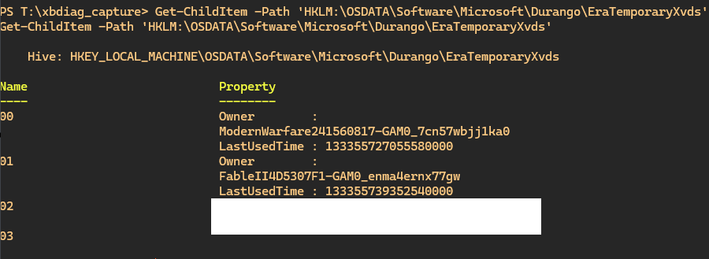

# Registry

## Where are hives mounted?

Here's how you can check where the registry HIVES are loaded/mounted into.
Note the special `XBOX` / `OSDATA` Hive.

Use `reg query HKEY_LOCAL_MACHINE\SYSTEM\CurrentControlSet\Control\hivelist` to query for this information

Recent sysupdate:

```
HKEY_LOCAL_MACHINE\SYSTEM\CurrentControlSet\Control\hivelist                                                                                                                                                                           
    \REGISTRY\MACHINE\HARDWARE REG_SZ                                                                                                                                                                    
    \REGISTRY\MACHINE\OSDATA    REG_SZ    \Device\HarddiskVolume2\Windows\System32\Config\XBOX                                                                                                                                 
    \REGISTRY\MACHINE\SOFTWARE    REG_SZ   \Device\HarddiskVolume1\Windows\System32\config\SOFTWARE                                                                                                                                   
    \REGISTRY\USER\.DEFAULT    REG_SZ    \Device\HarddiskVolume2\Windows\System32\Config\DEFAULT                                                                                                                                       
    \REGISTRY\MACHINE\SECURITY    REG_SZ    \Device\HarddiskVolume2\Windows\System32\Config\SECURITY.SEP                                                                                                                               
    \REGISTRY\MACHINE\SAM    REG_SZ    \Device\HarddiskVolume2\Windows\System32\Config\SAM.SEP                                                                                                                                         
    \REGISTRY\USER\S-1-5-20    REG_SZ    \Device\HarddiskVolume5\Windows\ServiceProfiles\NetworkService\NTUSER.DAT                                                                                                                     
    \REGISTRY\USER\S-1-5-19    REG_SZ    \Device\HarddiskVolume5\Windows\ServiceProfiles\LocalService\NTUSER.DAT                                                                                                                       
    \REGISTRY\USER\S-1-5-21-2702878673-795188819-444038987-503    REG_SZ    \Device\HarddiskVolume4\Users\DefaultAccount\NTUSER.DAT                                                                                                    
    \REGISTRY\USER\S-1-5-21-2702878673-795188819-444038987-503_Classes    REG_SZ    \Device\HarddiskVolume4\Users\DefaultAccount\AppData\Local\Microsoft\Windows\UsrClass.dat                                                          
    \REGISTRY\USER\S-1-5-21-2702878673-795188819-444038987-1008    REG_SZ    \Device\HarddiskVolume4\Users\UserMgr1\NTUSER.DAT                                                                                                         
    \REGISTRY\USER\S-1-5-21-2702878673-795188819-444038987-1008_Classes    REG_SZ    \Device\HarddiskVolume4\Users\UserMgr1\AppData\Local\Microsoft\Windows\UsrClass.dat                                                               
    \REGISTRY\USER\S-1-5-21-2702878673-795188819-444038987-1006    REG_SZ    \Device\HarddiskVolume4\Users\admin\NTUSER.DAT                                                                                                            
    \REGISTRY\USER\S-1-5-21-2702878673-795188819-444038987-1006_Classes    REG_SZ    \Device\HarddiskVolume4\Users\admin\AppData\Local\Microsoft\Windows\UsrClass.dat
```

Older sysupdate:

```
HKEY_LOCAL_MACHINE\SYSTEM\CurrentControlSet\Control\hivelist
    \REGISTRY\MACHINE\HARDWARE    REG_SZ
    \REGISTRY\MACHINE\XBOX    REG_SZ    \Device\HarddiskVolume2\Windows\System32\Config\XBOX
    \REGISTRY\MACHINE\SOFTWARE    REG_SZ    \Device\HarddiskVolume1\Windows\System32\config\SOFTWARE
    \REGISTRY\USER\.DEFAULT    REG_SZ    \Device\HarddiskVolume2\Windows\System32\Config\DEFAULT
    \REGISTRY\MACHINE\SECURITY    REG_SZ    \Device\HarddiskVolume2\Windows\System32\Config\SECURITY.SEP
    \REGISTRY\MACHINE\SAM    REG_SZ    \Device\HarddiskVolume2\Windows\System32\Config\SAM.SEP
    \REGISTRY\USER\S-1-5-19    REG_SZ    \Device\HarddiskVolume3\Windows\ServiceProfiles\LocalService\NTUSER.DAT
    \REGISTRY\USER\S-1-5-20    REG_SZ    \Device\HarddiskVolume3\Windows\ServiceProfiles\NetworkService\NTUSER.DAT
    \Registry\User\S-1-5-21-2702878673-795188819-444038987-503    REG_SZ    \Device\HarddiskVolume7\Users\DefaultAccount\NTUSER.DAT
    \Registry\User\S-1-5-21-2702878673-795188819-444038987-503_Classes    REG_SZ    \Device\HarddiskVolume7\Users\DefaultAccount\AppData\Local\Microsoft\Windows\UsrClass.dat
```

## Persistence

Only the User-related or `OSDATA` / `XBOX` (XConfig) hives are retained, everything else is reset on reboot and mirrored from HostOS into SRA.


## OSDATA

Location: `HKLM\OSDATA`

Persistent XConfig configuration.

### ERA Temporary Xvd Mapping

Location: `HKLM\OSDATA\Software\Microsoft\Durango\EraTemporaryXvds`

This maps temporary Xvds (named: `tempXX`) to the respective ERA-Title.

The temporary Xvds are located on the **Temp Storage** partition of the physical hard drive or NVME.



### Firewall

Xbox-specific firewall rules are stored in `HKLM:\OSDATA\FwStore\Local\FirewallXboxRules`.

Example of some rules

| Key                                                | Value          |
| -------------------------------------------------- | -------------- |
| XboxSRA-Devkit-WebManagement-HTTP-And-HTTPS-In-TCP | `v2.33|Action=Allow|Active=FALSE|Dir=In|Protocol=6|LPort=11080|LPort=11443|App=System|Name=Xbox SystemOS Inbound WebManagement HTTP and HTTPS [TCP 11080, 11443]|Desc=Inbound Xbox SystemOS rule allowing WebManagement HTTP and HTTPS TCP traffic|EmbedCtxt=Xbox SystemOS|` |
| PlayTo-QWave-Out-TCP-PlayToScope                   | `v2.33|Action=Allow|Active=TRUE|Dir=Out|Protocol=6|Profile=Private|Profile=Public|RPort=2177|RA42=Ply2Renders|RA62=Ply2Renders|App=%SystemRoot%\system32\svchost.exe|Svc=Qwave|Name=@FirewallAPI.dll,-36016|Desc=@FirewallAPI.dll,-36017|EmbedCtxt=@FirewallAPI.dll,-36001|` |
| XboxSRA-AllJoyn-Router-Out-UDP                     | `v2.33|Action=Allow|Active=TRUE|Dir=Out|Protocol=17|App=%SystemRoot%\system32\svchost.exe|Svc=AJRouter|Name=@FirewallAPI.dll,-37009|Desc=@FirewallAPI.dll,-37010|EmbedCtxt=Xbox SystemOS|` |
| OneCoreDbgSrv-Out-TCP                              | `v2.33|Action=Allow|Active=TRUE|Dir=Out|Protocol=6|App=%systemroot%\system32\debuggers\dbgsrv.exe|Name=OneCoreDbgSrv-Out|Desc=OneCoreDbgSrv Out|EmbedCtxt=OneCore TSP|` |

### OOBE (Out-of-Box-experience)

First-Start-Wizard aka. Out-of-Box-experience.

OOBE State is stored in `OSDATA` - Location: `HKLM\SYSTEM\XConfig\OOBEState`

Set OOBE to *Finished*-state, Hive: `HKLM\SYSTEM\XConfig\OOBEState` Key: `Version1` Type: `REG_DWORD` Value: `1`


## Reading / Modifying the registry

| Method              | Retail Mode compatible |
| ------------------- | ---------------------- |
| reg.exe             |  no                    |
| Remote Registry     |  no                    |
| Powershell          |  yes¹                  |
| Native/Managed code |  yes                   |

**¹**: Powershell currently does not run on [Collateral damage](../exploits/game-script-code-exec.md)

## Remote Registry

You can enable the system service for Remote Registry `sc.exe start remoteregistry`.

Reference: [MS: Remotely edit the registry](https://learn.microsoft.com/en-us/troubleshoot/windows-server/system-management-components/remotely-edit-the-registry)

## reg.exe

Use the `reg save` command, like so:

```
# Store XBOX hive

REG SAVE HKLM\OSDATA D:\DevelopmentFiles\OSDATA.hiv
# for older sysupdates:
# REG SAVE HKLM\XBOX D:\DevelopmentFiles\XBOX.hiv

REG SAVE HKLM\HARDWARE D:\DevelopmentFiles\HARDWARE.hiv
REG SAVE HKLM\SOFTWARE D:\DevelopmentFiles\SOFTWARE.hiv
REG SAVE HKLM\SECURITY D:\DevelopmentFiles\SECURITY.hiv
REG SAVE HKLM\SAM D:\DevelopmentFiles\SAM.hiv
REG SAVE HKU\ D:\DevelopmentFiles\HKU.hiv
REG SAVE HKCU\ D:\DevelopmentFiles\HKCU.hiv
```

## Powershell

```
cd HKLM:
.. do stuff ..
```

## Native code

You can talk to the Registry via native and managed code.


## Tools

To work for dumped registry hives, the following tools are a great help:

- [Registry Spy](https://github.com/andyjsmith/registry-spy)
- [regdump](https://github.com/adoxa/regdump)