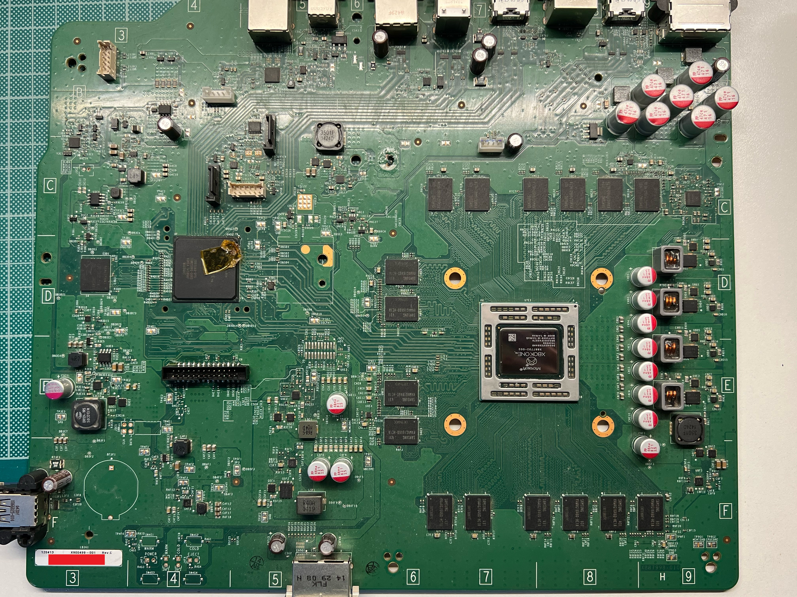

# Retail Xbox One Motherboard SKU listing

This page aims to become an exhaustive list of every different motherboard models / SKUs out there. **It is currently Work In Progress.**

At the moment, the following identificators are collected, and where to find them:

For Xbox One Phat:

- PCB Label Number: This is the number, starting with X, that appears on the motherboard's label, in the front layer.

- PCB Soldermask Number: This is the number, starting with X, that appears on the bottom right corner, in the front layer.

- Hardware description / differences: relevant changes in components, etc.

- Owned by / Contributed by: who discovered the board revision.

- Pictures.

For Xbox One S/X:

- Same as above. Update this page with where to find the identificators on the boards.

## Contributing models and pictures

Upload your PCB pictures to the directory */docs/hardware/*.

Use the following guidelines:

* Create a subdirectory with the name of the soldermask SKU (The one on the front side of the motherboard, in the bottom right corner, starting with X. NOT THE ONE ON THE LABEL)

* Upload at least two pictures: front and back

* Make sure they are high resolution, such that the SKUs are visible when zooming in.

* Update the SKUs page accordingly.

## Xbox One Phat

### Durango Revisions

* **PCB Label Number**: X884497 - 001 Rev F-2
* **PCB Soldermask Number**: X877750-003
* **Hardware description / differences**: -
* **Owned by / Contributed by**: Bradman117
* **Pictures**: 

### Silverton Revisions

* **PCB Label Number**: X933919 - 001 Rev. C
* **PCB Soldermask Number**: -
* **Hardware description / differences**: Reduced eMMC/Southbridge voltage regulator with unknown voltage divider.
* **Owned by / Contributed by**: Anonymous
* **Pictures**:

Not available yet

---
* **PCB Label Number**: X900499 - 001 Rev. C
* **PCB Soldermask Number**: X887998-010
* **Hardware description / differences**: Reduced eMMC/Southbridge voltage regulator with unknown voltage divider. Does not contain data lines on the bottom layer of the PCB, under the HDMI ports.
* **Owned by / Contributed by**: TorusHyperV
* **Pictures**:
  

---
* **PCB Label Number**: X940636 - 001 Rev. A
* **PCB Soldermask Number**: X902472-006
* **Hardware description / differences**: Reduced eMMC/Southbridge voltage regulator with known voltage divider. Dark green soldermask, instead of light green.
* **Owned by / Contributed by**: TorusHyperV
* **Pictures**:

## Xbox One S
_Your help is needed to complete this page! Fork this repo and make a Pull Request to contribute_

## Xbox One S - all digital
_Your help is needed to complete this page! Fork this repo and make a Pull Request to contribute_

## Xbox One X
_Your help is needed to complete this page! Fork this repo and make a Pull Request to contribute_
