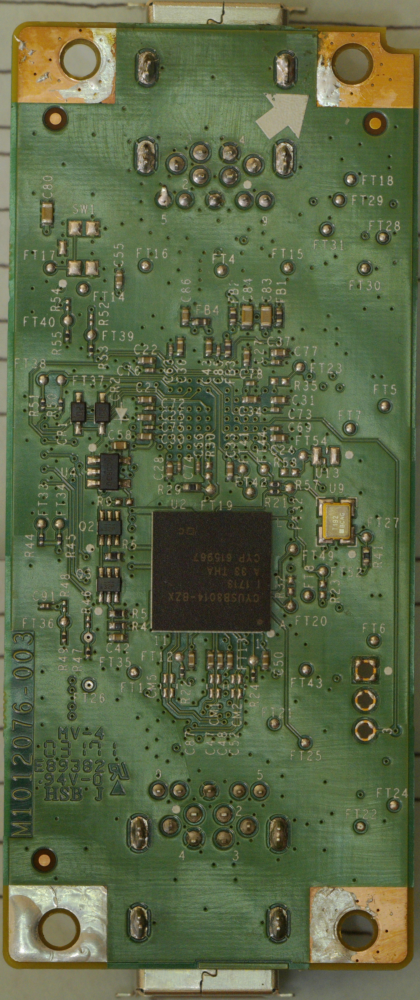
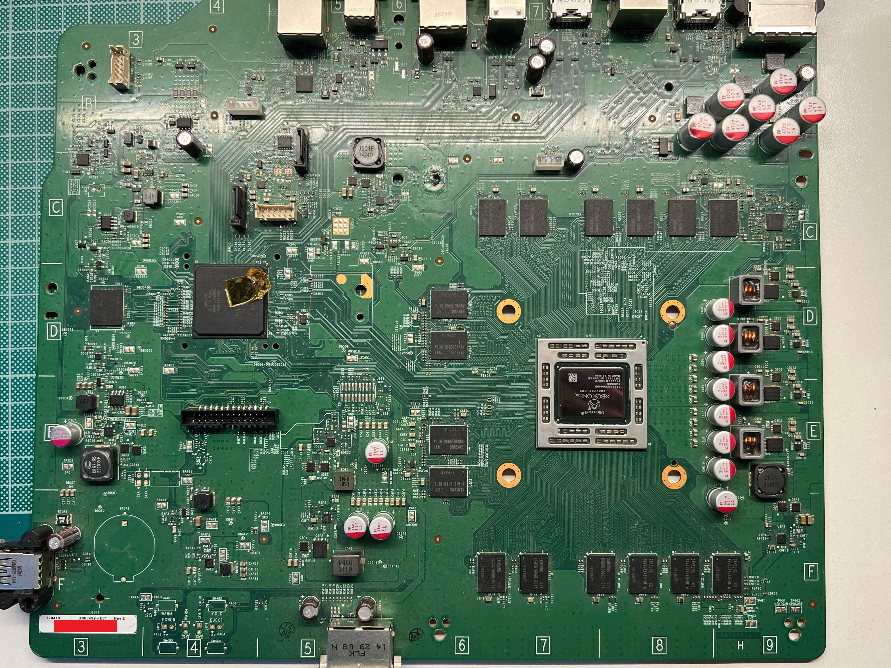
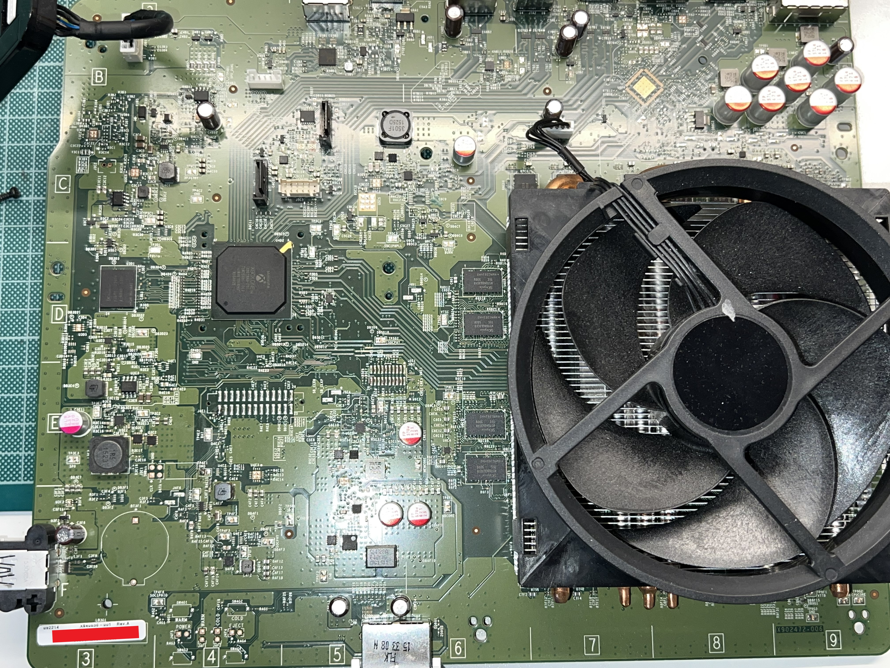

# Retail Xbox One Motherboard SKU listing

This page aims to become an exhaustive list of every different motherboard models / SKUs out there.

## Xbox One Phat

### Durango Revisions

* **PCB Label Number**:
* **PCB Soldermask Number**:
* **Hardware description / differences**:
* **Owned by / Contributed by**: public domain
* **Pictures**: 

  

### Silverton Revisions

* **PCB Label Number**: X933919 - 001 Rev. C
* **PCB Soldermask Number**: -
* **Hardware description / differences**: Reduced eMMC/Southbridge voltage regulator with unknown voltage divider.
* **Owned by / Contributed by**: Anonymous
* **Pictures**:

  
Not available yet

---
* **PCB Label Number**: X900499 - 001 Rev. C
* **PCB Soldermask Number**: X887998-010
* **Hardware description / differences**: Reduced eMMC/Southbridge voltage regulator with unknown voltage divider. Does not contain data lines on the bottom layer of the PCB, under the HDMI ports.
* **Owned by / Contributed by**: TorusHyperV
* **Pictures**:

  

---
* **PCB Label Number**: X940636 - 001 Rev. A
* **PCB Soldermask Number**: X902472-006
* **Hardware description / differences**: Reduced eMMC/Southbridge voltage regulator with known voltage divider. Dark green soldermask, instead of light green.
* **Owned by / Contributed by**: TorusHyperV
* **Pictures**:

  

## Xbox One S
_Your help is needed to complete this page! Fork this repo and make a Pull Request to contribute_

## Xbox One S - all digital
_Your help is needed to complete this page! Fork this repo and make a Pull Request to contribute_

## Xbox One X
_Your help is needed to complete this page! Fork this repo and make a Pull Request to contribute_
