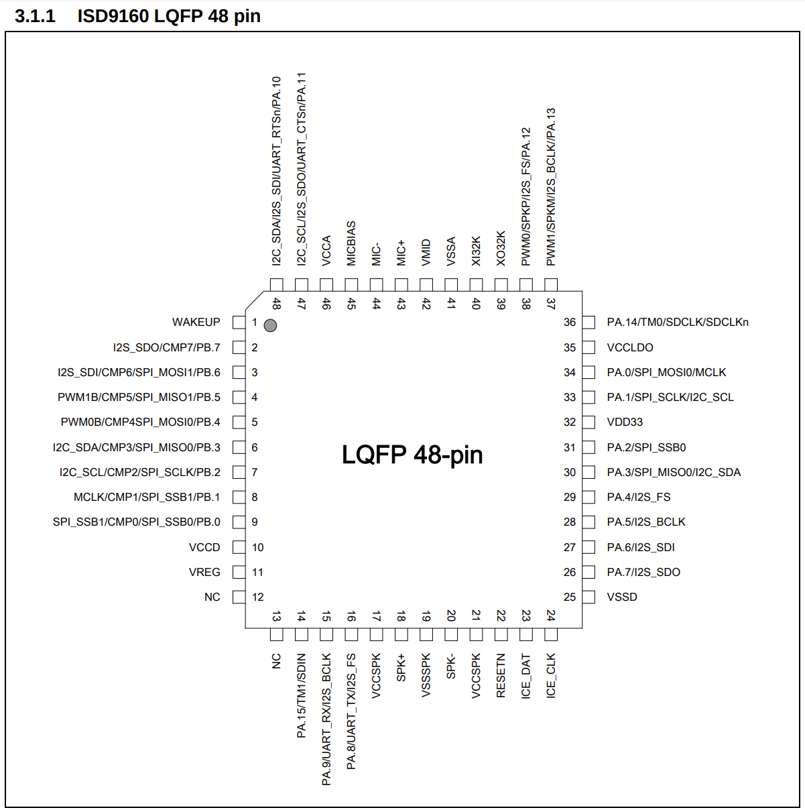

# RF Unit

## Info

### Xbox One (PHAT)

Part Number: X867281-005
Codename: Lithium

Components:

- Infrared Receiver (U1)
- Soundchip - ISD9160F (U4)
- Connector to sound speaker (J1)
- Wifi Antenna connector (J2)
- FPC connector (J3)
- Motherboard connector (J8)
- Unpopulated (SW2)

####  General

The RF Unit, compared to Xbox 360, is very simple. It does not contain any RF hardware onboard.
It only contains an IR Receiver, the Nuvoton Soundcorder Chip (which also handles button presses from the front panel touch buttons) and an internal antenna.
Actual RF communication is happening via [Wifi module](wifi.md).

Communication from the Nuvotun chip to the Southbridge is done via I2C.

#### Connector (J8)

Pinout

| Pin| Function        |
|----|-----------------|
|  1 | LED Nexus       |
|  2 | LED Halo        |
|  3 | LED Zone        |
|  4 | 5V (VCC)        |
|  5 | I2C CLK         |
|  6 | I2C DATA        |
|  7 | IR Data         |
|  8 | PWR Switch (N)  |
|  9 | GND             |
| 10 | EJECT Switch (N)|
| 11 | INT_N           |
| 12 | 3,3V STDBY      |
| 13 | BIND Switch (N) |
| 14 | GND             |
| 15 | -               |
| 16 | -               |
| 17 | -               |
| 18 | GND             |
| 19 | GND             |

#### FPC Connector (J3)

Pinout

| Pin | Function | ISD9160F Pin |
| ----| ---------| -------------|
| 1   |  Power   |            9 |
| 2   |  Power   |            8 |
| 3   |  -       |             -|
| 4   |  -       |             -|
| 5   |  -       |             -|
| 6   |  Eject   |            7 |
| 7   |  Eject   |            6 |

Bridge the respective pins briefly to trigger action.

FPC Cable / capacitive front panel buttons are directly wired to the ISD-Chip.

#### Nuvoton Soundcorder chip (U4)

Responsible for playing the power-on/off and eject sounds.

Model: ISD9160F

Datasheet: [ISD9160FI](./rf-unit/1811151450_Nuvoton-Tech-ISD9160FI_C79806.pdf)

Pinout (from the official datasheet linked above)



This IC has multiple possible pin-configurations, the following are verified signals.

| Pin | Function                   |
| --- | -------------------------- |
|   6 | Eject button (FPC - Pin 7) |
|   7 | Eject button (FPC - Pin 6) |
|   8 | Power button (FPC - Pin 2) |
|   9 | Power button (FPC - Pin 1) |
|  47 | I2C SCL (CLK)              |
|  46 | I2C SDA (DAT)              |

##### I2C

Captured via Logic Analyzer from Pin 5,6 on RF Unit.

I2C address: `0x5A`

Commands

| Byte | Name           | Args           | Reads data |
| ---- | -------------- | -------------- | ---------- |
| 0xC0 | Interrupt Read | /              |        Yes |
| 0x48 | Register Write | Register, Data |         No |
| 0xC1 | Register Read  | /              |        Yes |
| ---- | -------------- | -------------- | ---------- |
| 0x81 | Start Sound    | Sound index    |         No |
| 0x02 | Stop Sound     | /              |         No |
| 0x42 | Reset          | 0x55           |         No |

Registers

| Num  | Name          | Read/Write |
| ---- | ------------- | ---------- |
| 0x0C | Status        | READ-ONLY  |
| 0x04 | Address0      | R/W        |

Available sounds

| Index| Name         |
| ---- | ------------ |
| 0x00 | PowerOn      |
| 0x01 | Ding         |
| 0x02 | PowerOff     |
| 0x03 | DiscDrive1   |
| 0x04 | DiscDrive2   |
| 0x05 | DiscDrive3   |
| 0x06 | Plopp        |
| 0x07 | No Disc      |
| 0x08 | Plopp Louder |

Init sequence:

```
WRITE [CMD_REGISTER_WRITE, REG_STATUS, 0x01]
WRITE [CMD_REGISTER_WRITE, REG_ADDR0, 0xFF, 0xFF]
```

Play sound

```
WRITE [CMD_START, SOUND_INDEX]
```

Stop sound

```
WRITE [CMD_STOP]
```

Reset

```
WRITE [CMD_RESET, 0x55]
```

Write register

```
WRITE [CMD_REGISTER_WRITE, <REGISTER>, <DATA>]
```

Read register

```
WRITE [CMD_REGISTER_READ, <REGISTER>]
READ <DATA>
```

Read interrupt

```
WRITE [CMD_INTERRUPT_READ]
READ <DATA>
```


To get a sound playing, this is the full flow done by the console

```
- Init
- Stop
- Play sound
```

**Example code**

I2C Hardware: GreatFET One Devboard

```py
"""
Xbox One I2C RF Unit

Connections:

5V -> RF Unit, Pin 4
3.3V -> RF Unit, Pin 12
SDA (Pin 39) -> RF Unit, Pin 6
SCL (Pin 40) -> RF Unit, Pin 5

Hardware:
* GreatFET One

Dependencies:
* greatfet
"""

from enum import Enum
from typing import List
import greatfet
from greatfet.interfaces.i2c_bus import I2CBus
from greatfet.interfaces.i2c_device import I2CDevice

I2C_ADDR = 0x5A

"""
Commands
"""

CMD_INTERRUPT_READ_xC0 = 0xC0
CMD_REG_WRITE_x48 = 0x48
CMD_REG_READ_xC1 = 0xC1

CMD_START_x81 = 0x81
CMD_STOP_x02 = 0x02
CMD_RESET_x4A = 0x4A


"""
Registers
"""

# R/W I2C Control Register
REG_CTL = 0x00
# R/W I2C Slave address Register0
REG_ADDR0 = 0x04
# R/W I2C DATA Register
REG_DAT = 0x08
# R I2C Status Register
REG_STATUS = 0x0C
# R/W I2C clock divided Register
REG_CLKDIV = 0x10
# R/W I2C Time out control Register
REG_TOCTL = 0x14
# R/W I2C Slave address Register1
REG_ADDR1 = 0x18
# R/W I2C Slave address Register2
REG_ADDR2 = 0x1C
# R/W I2C Slave address Register3
REG_ADDR3 = 0x20
# R/W I2C Slave address Mask Register0
REG_ADDRMSK0 = 0x24
# R/W I2C Slave address Mask Register1
REG_ADDRMSK1 = 0x28
# R/W I2C Slave address Mask Register2
REG_ADDRMSK2 = 0x2C
# R/W I2C Slave address Mask Register3
REG_ADDRMSK3 = 0x30

class Sound(Enum):
    POWERON = 0x00
    BING = 0x01
    POWEROFF = 0x02

    DISC_DRIVE_1 = 0x03
    DISC_DRIVE_2 = 0x04
    DISC_DRIVE_3 = 0x05

    PLOPP = 0x06
    NO_DISC = 0x07
    PLOPP_LOUDER = 0x08

gf = greatfet.GreatFET()

bus = I2CBus(gf)
dev = I2CDevice(bus, I2C_ADDR)

def init():
    write_register(REG_STATUS, [0x01])
    write_register(REG_ADDR0, [0xFF, 0xFF])

def stop():
    dev.write([CMD_STOP_x02])

def write_register(register: int, data: List[int]):
    write_data = [CMD_REG_WRITE_x48]
    write_data.extend([register])
    write_data.extend(data)

    dev.write(write_data)

def read_interrupt() -> List[int]:
    return dev.transmit([CMD_INTERRUPT_READ_xC0], 2)

def read_register(register: int) -> List[int]:
    return dev.transmit([CMD_REG_READ_xC1, register], 4)

def play_sound(num: Sound|int):
    if isinstance(num, Sound):
        num = num.value
    dev.write([CMD_START_x81, num])

def reset():
    dev.write([CMD_RESET_x4A, 0x55])

class RegCONTROL:
    def __init__(self, val: int):
        self.val = val
        self.INTEN = (val & (1 << 7)) != 0
        self.I2CEN = (val & (1 << 6)) != 0
        self.STA = (val & (1 << 5)) != 0
        self.STO = (val & (1 << 4)) != 0
        self.SI = (val & (1 << 3)) != 0
        self.AA = (val & (1 << 2)) != 0
        # Reserved bits
        assert (val & 2) == 0
        assert (val & 1) == 0
    
    def __str__(self):
        return f"Status({self.val}) INTEN={self.INTEN} I2CEN={self.I2CEN} STA={self.STA} STO={self.STO} SI={self.SI} AA={self.AA}"

if __name__ == "__main__":
    init()
    stop()
    play_sound(Sound.BING)

```

##### Read/Write internal flash

This has not been successful so far...

Two sample implementations how the chip *could* be programmed.

- [Trumpet project](https://github.com/robbie-cao/trumpet) on github
- [Piccolo project](https://github.com/robbie-cao/piccolo) on github

### Xbox One S

Codename: Sodium

#### Pinout

Connector

| Pin| Function        |
|----|-----------------|
|  1 | LED Nexus       |
|  2 | -               |
|  3 | IR Blaster      |
|  4 | PWR Switch (N)  |
|  5 | EJECT Switch (N)|
|  6 | INT_N           |
|  7 | 3,3V STDBY      |
|  8 | 5V              |
|  9 | ACC_RESET       |
| 10 | IR (RX)         |
| 11 | GND             |
| 12 | USB2 (-)        |
| 13 | USB2 (+)        |
| 14 | GND             |
| 15 | I2C CLK         |
| 16 | I2C DATA        |

### Xbox One X

Codename: Cactus

**NOTE**: Front panel on Xbox One X does not use I2C anymore.

#### Pinout

| Pin| Function        |
|----|-----------------|
|  1 | IR (RX)         |
|  2 | EJECT Switch (N)|
|  3 | -               |
|  4 | IR Blaster      |
|  5 | ACC_RESET       |
|  6 | GND             |
|  7 | USB2 (-)        |
|  8 | USB2 (+)        |
|  9 | 3,3V STDBY      |
| 10 | GND             |
| 11 | -               |
| 12 | -               |
| 13 | -               |
| 14 | PWR Switch (N)  |
| 15 | LED Nexus       |
| 16 | 5V              |

## Pictures
Xbox One (PHAT)


Xbox One S


Xbox One X (SCORPIO)

## Credits
- [Pictures from ifixit.com](https://www.ifixit.com/Search?c-doctype_namespace=product&doctype=product&query=xbox%20one)