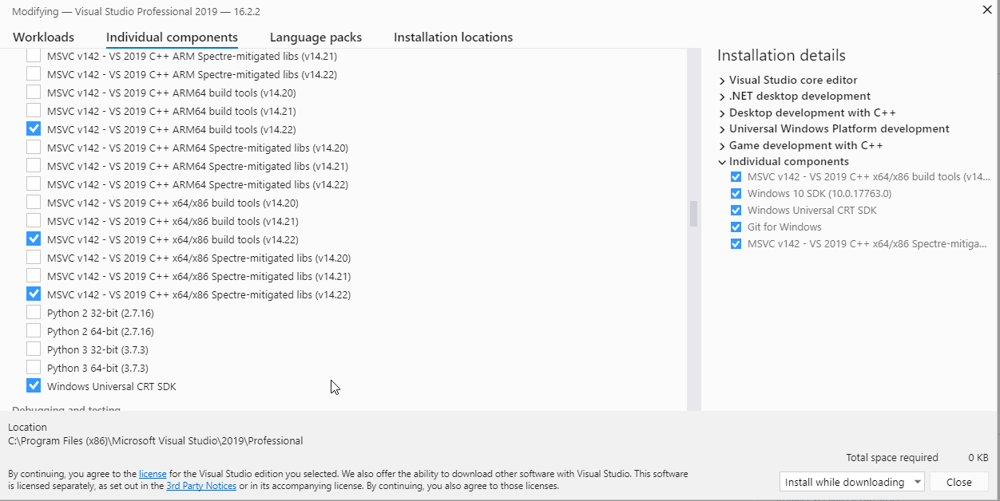

<!-- TITLE: Setup Dev Mode -->
<!-- SUBTITLE: A quick summary of Setup Dev Mode -->

# Setup dev mode
## Prerequisites

  - [App Developer Account](https://developer.microsoft.com/en-us/store/register)
  - [Dev Mode Activation App](https://www.microsoft.com/en-gb/p/dev-mode-activation/9vwgnh0vbn60)
  - [Visual Studio 2019](https://visualstudio.microsoft.com/vs/)
  - Windows 10 (Preferred)
  - PuTTy

## Activation

Before you get started you will need to convert your console into
Developer Mode. Microsoft have an existing page that will show you how
to get started:
<https://docs.microsoft.com/en-us/windows/uwp/xbox-apps/devkit-activation>

It may be worth navigating through their documentation and getting a
grasp on the basis of the environment:
<https://docs.microsoft.com/en-us/windows/uwp/xbox-apps/>

## Visual Studio Setup

In order for you to build Win32 applications and libraries you will need
to install certain libraries available through the Visual Studio
Installer:

|                                   |
| --------------------------------- |
|  |

## Using SSH

After your console is activated you will be able to connect over via
PuTTy (or another SSH client of your choice).

  - Enter the console IP address and Connect
  - Use the following to login:
      - Username: DevToolsUser
      - For the password you are able to use either
	      - pin that is displayed on the "Show Visual Studio Pin" in Dev Home.
      - or
	      - password used for smb access
  - Success\!

## Accessing Console File System

Open up the File Explorer on your Windows machine and enter the
following into your path bar:

```
\\<Xbox One IP or Hostname>
```

It will prompt you for login details. We can use the Xbox Device Portal
for this:

  - Open up your web browser and enter:
    `https://<Xbox One IP or Hostname>:11443`
  - Go to File explorer
  - On the right hand side; you will see "Browse"
  - Select it and use the login details provided
