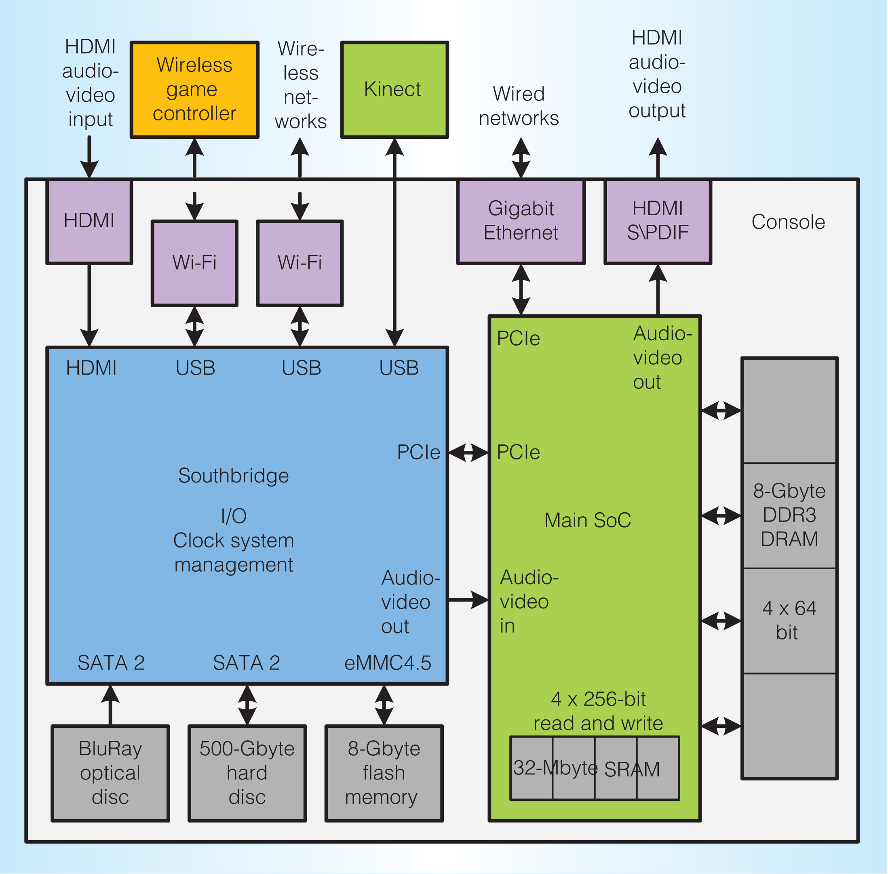

# Southbridge
The custom southbridge is only slightly changed between the console revision, judging from its part number.

## Models
- X861949-005 T6WD5XBG-0003 (Xbox One/Xbox One S)
- X861949-007 T6WD5XBG-0003 (Xbox One X)

## Diagrams

## References
- [Southbridge / SoC diagram](https://www.computer.org) by IEEE Computer Society