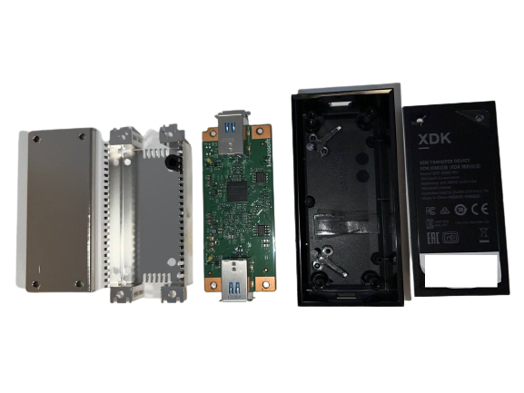
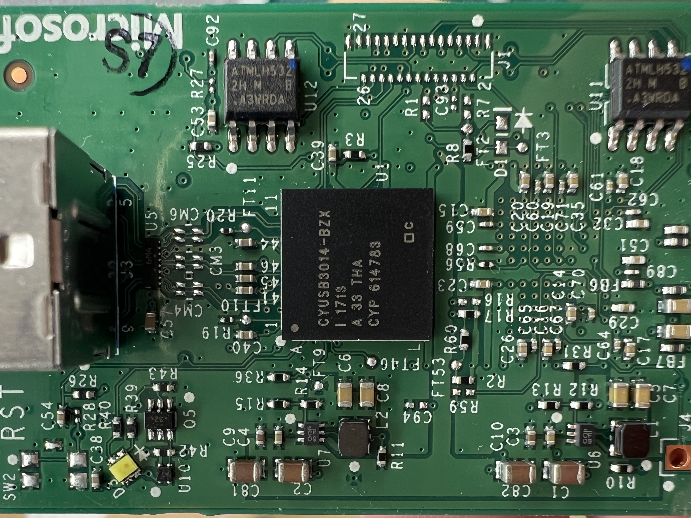

# XDK Transfer Device

The XDK Transfer Device is a special hardware accesory available oficially only to registered Xbox developers. Its main purpose is to allow for very fast trasnfers of data, mainly aimed at transfering game builds during the development phase. It is presumably no longer needed for the next generation of consoles (Series X/S) since these natively support fast data transfer rates thanks to their SSD technology
. These devices are typically sold for cheap on eBay and similar marketplaces since they don't have any real use for normal gamers.

## Hardware

The XDK Transfer Device box contains four TORX head screws located in the back of the device, under the sticker:

  

Internally, the device contains two heatsinks for heat disipation when doing data transfers. The PCB has a rectangular shape.

  

The XDK Transfer device contains two `ATMLH532` i2c EEPROMs and two main `CYUSB3014-BZXI` ICs, which are essentially dedicated ARM926 EJ-S cores capable of 5 GBit/s USB speeds. The following is a block diagram depicting the design and main features of these cores. 

  

  

## Kernel Software

The SystemOS driver that communicates with the XDK Transfer Device is called `xbtplinkc.sys` and can be found in C:\Windows\System32. Its full name is the `Xbox Transport Protocol Link Client` driver. The "Client" part of the name is Hyper-V terminology, hence we can presume there exists a counterpart XbtpLinkP (provider) driver in the HostOS, which dispatches requests.

There are (at least) two known major versions of this SystemOS driver. XbtplinkC from 2017/2018 OS's is a very small driver in size (just a dozen Kb), while the driver in the latest OS revisions (2023) performs more tasks and is bigger in size (around 50 Kb).

The driver registers the device `\\??\\XbtpLink` but does not create any symlinks available to userland. In other words, it cannot receive IOCTLs from userland apps. The drivers does handle some IOCTLs, so it might [receive IOCTLs from other kernel drivers](https://learn.microsoft.com/en-us/windows-hardware/drivers/kernel/creating-ioctl-requests-in-drivers), though.

The following two IOCTL are handled:
|  Code     | Name      | Description  |
|-----------|-----------|--------------|
| 0x220007  | Unknown   | Unknown      | 
| 0x22000b  | Unknown   | Unknown      | 

## Userland Software

Additionally, a userland DLL called `xbtp.dll` can be found in `J:\tools\` in developer mode consoles. More investigation is required but this is likely used by some app which communicates with the XBTPLinkC driver.
